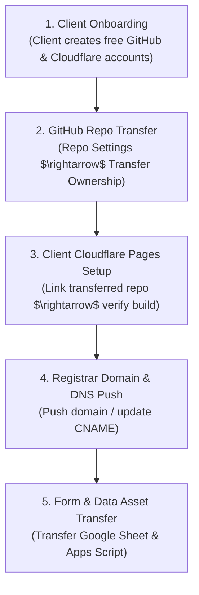

# Client Ownership Handoff Protocol

This rule governs the standard operating procedure for transferring a website, repository, hosting, and credentials to a client with **zero downtime**.

---

## 1. Architectural Decoupling Requirement

All client projects must be architected from day one as self-contained codebases:
* Standard HTML5 / Tailwind / Vite / React static code.
* Zero proprietary CMS lock-in or subscription-dependent plugins.
* Zero hardcoded agency secrets or credentials.

---

## 2. Step-by-Step Zero-Downtime Handoff Checklist

Whenever a client requests direct ownership of their website, execute the following steps in sequence:

### Phase 1: Client Account Setup
1. Instruct the client to create free accounts on:
   - **GitHub** (`github.com/signup`)
   - **Cloudflare** (`dash.cloudflare.com/sign-up`)
   - Registrar account (e.g. Cloudflare Registrar, Namecheap, or Google Domains) if domain was purchased on their behalf.

### Phase 2: Repository Transfer
1. Navigate to the client's repository on GitHub: `Settings` $\rightarrow$ `General` $\rightarrow$ `Danger Zone` $\rightarrow$ `Transfer ownership`.
2. Enter the client's GitHub username or organization name.
3. Client accepts the transfer invitation. All commit history, branches, and issue history are preserved.

### Phase 3: Cloudflare Pages Linking
1. Client logs into their Cloudflare dashboard $\rightarrow$ `Workers & Pages` $\rightarrow$ `Create application` $\rightarrow$ `Pages` $\rightarrow$ `Connect to Git`.
2. Select the transferred GitHub repository.
3. Configure build settings (matching existing configuration):
   - Framework preset: Vite / None
   - Build command: `npm run build`
   - Output directory: `dist`
4. Deploy the site. Verify that `<client-project>.pages.dev` builds with 100% parity.

### Phase 4: Zero-Downtime DNS Cutover
1. If domain is held in agency Cloudflare registrar:
   - Initiate a domain transfer / push to client's Cloudflare account (or unlock and transfer auth code).
2. If domain DNS is managed via CNAME:
   - Add the custom domain in the client's new Cloudflare Pages project.
   - Point the domain's CNAME record to `<client-project>.pages.dev`.
   - **Because Cloudflare's edge network proxies both zones, the DNS cutover happens instantly with ZERO downtime and uninterrupted SSL certificates.**

### Phase 5: Lead Sheet & Webhook Ownership Transfer
1. Open the client's Google Sheet (`Leads` and `Staging_Queue`).
2. Share the Sheet with the client's Google account $\rightarrow$ Change role to **Owner**.
3. In Google Apps Script, update project ownership to the client.

### Phase 6: Retainer Transition / Decommission
1. Archive internal agency staging branch.
2. If client opts for the ongoing **AI Concierge Managed Retainer**, maintain the `/api/concierge` dispatch route and Google Sheet queue integration.
