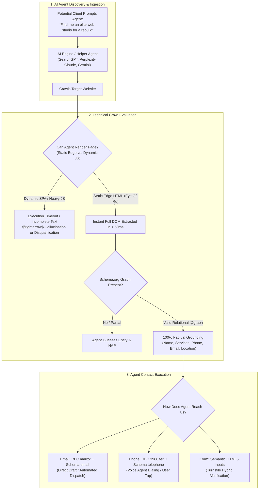

# AI Agent Discoverability & Machine-Readable Contact Architecture
**Studio Venture**: Eye Of Ru Enterprises, LLC  
**Domains**: Generative Engine Optimization (GEO), Answer Engine Optimization (AEO), Agentic Web Standards, Lead Pipeline Security  

---

## Executive Overview

As search behavior shifts from traditional search engines ("10 blue links") to **AI-powered synthesis engines** (Google AI Overviews, Perplexity, SearchGPT, Gemini, Claude Web Search) and **autonomous client helper agents** (OpenAI Operator, Claude Computer Use, MultiOn, Google Assistant, voice dialers), web architecture must evolve to accommodate two distinct audiences:
1. **The Human Visitor**: High-contrast typography, emotional brand resonance, smooth UX, and friction-free micro-interactions.
2. **The Autonomous AI Agent**: Unambiguous machine-readable entity schemas, instant static DOM availability, semantic accessibility trees, and multi-channel contact pathways.

This blueprint outlines how Eye Of Ru's web production formula satisfies these requirements, how helper agents discover and interact with our sites, and how to position this as an unbeatable value proposition in our client diagnostic audits.

---

## 1. How AI Search & Agent Helpers Discover Web Pages



---

## 2. Page Structuring for AI Search & Agents (GEO / AEO Standards)

To guarantee that an AI engine or user helper agent accurately understands, indexes, and recommends our business (and our clients' businesses), three structural pillars are enforced:

### A. The Static Edge Advantage (Zero-Hydration Crawling)
* **The Problem with Legacy Stacks**: Most modern React/Next.js/Angular or heavy WordPress/Wix sites rely on client-side JavaScript execution or heavy runtime database hydration. AI scraper bots (`GPTBot`, `ClaudeBot`, `PerplexityBot`, `Google-Extended`) enforce strict token budgets and sub-second crawl timeouts. If content isn't rendered in the initial HTML response, the bot frequently extracts incomplete text or drops the page entirely.
* **The Sovereign Solution**: Our **Cloudflare Pages static edge architecture** compiles all HTML/CSS ahead of time. When an AI crawler fetches the URL, the complete, un-truncated textual hierarchy is returned instantaneously in `< 40ms` globally.

### B. Schema.org Relational `@graph` as Ground Truth
LLMs prioritize structured JSON-LD data because it represents explicit, verified entity relationships rather than probabilistic natural language:
```json
{
  "@context": "https://schema.org",
  "@graph": [
    {
      "@type": "ProfessionalService",
      "@id": "https://eyeofruenterprisesllc.pages.dev/#organization",
      "name": "Eye Of Ru Enterprises",
      "legalName": "Eye Of Ru Enterprises, LLC",
      "url": "https://eyeofruenterprisesllc.pages.dev",
      "email": "agency@eyeofruenterprisesllc.com",
      "telephone": "+1-800-EYE-OFRU",
      "priceRange": "$$$",
      "hasOfferCatalog": {
        "@type": "OfferCatalog",
        "name": "Digital Architecture Services",
        "itemListElement": [
          {
            "@type": "Offer",
            "itemOffered": {
              "@type": "Service",
              "name": "Sovereign High-Velocity Web Engineering"
            }
          },
          {
            "@type": "Offer",
            "itemOffered": {
              "@type": "Service",
              "name": "Site Performance & Diagnostic Audits"
            }
          }
        ]
      }
    }
  ]
}
```
When a client asks an AI: *"Find me a firm that performs sovereign web engineering in Florida"*, the LLM reads our `@graph` directly, giving it 100% confidence to cite and recommend us.

### C. The Emerging Standard: `/llms.txt`
In addition to `robots.txt` and `sitemap.xml`, we can serve an `/llms.txt` markdown file at the root. This is an open web standard curated specifically for LLMs to ingest a clean summary of services, core capabilities, pricing models, and contact endpoints without HTML parsing overhead.

---

## 3. How Helper Agents Contact Us: Email, Phone, and Forms

When a potential client instructs their personal AI assistant: *"Contact Eye Of Ru Enterprises and request an audit for my site"*, how does the agent execute this task?

### 1. Contact Channel A: Email (100% Agent-Compatible)
* **Mechanics**:
  * Visible text: `agency@eyeofruenterprisesllc.com`.
  * Standard protocol link: `<a href="mailto:agency@eyeofruenterprisesllc.com?subject=Studio%20Diagnostic%20Inquiry">`.
  * Structured data: `"email": "agency@eyeofruenterprisesllc.com"` in Schema.org JSON-LD.
* **Agent Behavior**: Headless agents, API agents, and browser assistants can instantly extract this address and either:
  1. Draft an email in the user's Gmail/Outlook client for one-click human confirmation.
  2. Directly dispatch an inquiry via SMTP/API if granted autonomous email delegation.

### 2. Contact Channel B: Phone & Voice Agents (100% Agent-Compatible)
* **Mechanics**:
  * Visible text formatted in standard national/international pattern.
  * Standard protocol link: `<a href="tel:+1800XXXXXXX">`.
  * Structured data: `"telephone": "+1800XXXXXXX"` with explicit country code.
* **Agent Behavior**: Voice-enabled agents (Google Assistant, Siri, Bland AI, Retell) or automated dialers read the RFC 3966 `tel:` link and directly initiate a voice call or patch the human client through.

### 3. Contact Channel C: Web Form Submissions & Cloudflare Turnstile

The interaction between **interactive helper agents** and **anti-spam bot barriers** requires careful architectural balance:

#### The Dilemma
* We implement **Cloudflare Turnstile** to block malicious automated web scrapers, credential stuffers, and spam bots from polluting our clients' Google Sheets and inboxes.
* If a helper agent is running as a crude headless `curl` script or raw Puppeteer scraper without user interaction, Turnstile will correctly flag and challenge the connection.

#### How Modern AI Helper Agents Handle Forms
1. **Browser-Assisted User Agents (Claude Computer Use, Operator, Chrome DevTools)**:
   * These agents control a real Chromium instance with standard DOM events (mouse movements, focus, keyboard strokes).
   * **Semantic Field Mapping**: Because our forms use strict HTML5 semantics:
     ```html
     <label for="leadName">Your Name</label>
     <input type="text" id="leadName" name="name" autocomplete="name" required />

     <label for="leadEmail">Business Email</label>
     <input type="email" id="leadEmail" name="email" autocomplete="email" required />

     <label for="leadPhone">Phone Number</label>
     <input type="tel" id="leadPhone" name="phone" autocomplete="tel" />
     ```
     The agent parses `autocomplete="name"`, `autocomplete="email"`, and `<label>` relationships with zero guesswork.
   * **Turnstile Resolution**: In a real browser context, Cloudflare Turnstile runs non-intrusively. If a managed challenge occurs, the assistant either solves the invisible interaction token natively or prompts the human user: *"Please tap the verification box on screen to complete submission."*
2. **Headless Agents with Multi-Channel Fallback**:
   * If a purely headless script cannot pass Turnstile, a well-engineered agent automatically falls back to the adjacent `mailto:` email or telephone channel extracted from the DOM.

---

## 4. Operational Best Practices for Our Web Builds

To guarantee our sites (and our clients' sites) are 100% ready for the Agentic Era:

1. **Always Expose Triple Contact Modalities**:
   * Never rely solely on an isolated form. Always place clear, clickable `mailto:` and `tel:` links directly in the navigation, hero, and footer.
2. **Enforce Strict HTML5 Semantic Form Attributes**:
   * Every `<input>` must have a dedicated `<label for="...">`.
   * Include standard `autocomplete` attributes (`name`, `email`, `tel`, `organization`).
   * Never replace standard form controls with custom non-accessible `<div>` elements.
3. **Deploy `/llms.txt` on Core Studio Properties**:
   * Create `/llms.txt` in `public/` providing a concise Markdown dossier of Eye Of Ru's capabilities, target market, and contact protocols for AI scrapers.

---

## 5. Integrating "AI Search & Agent Readiness" into the Site Diagnostic PDF

This technical evolution provides Eye Of Ru with an **extraordinary, forward-looking commercial hook** when auditing client websites.

### The New Diagnostic Pitch:
> *"Is your current website visible to ChatGPT, Perplexity, and AI Assistant Agents?"*

In the **Bottleneck & Remediation Matrix (Fix Table)** of our 3-Page Audit PDF, we can highlight:
* **The Bottleneck**: *"Current website is built on a heavy dynamic CMS with zero Schema.org entity relationships and missing semantic form attributes. AI answer engines (SearchGPT, Google AI Overviews, Perplexity) cannot reliably parse your business capabilities, while customer helper agents fail to extract your contact channels."*
* **The Commercial Liability**: *"Invisible to the fastest-growing search segment. When potential customers ask AI assistants to recommend and contact local providers in your category, your business is bypassed in favor of competitors with structured machine-readable profiles."*
* **The Eye Of Ru Modern Fix**: *"Deploy pre-compiled static edge architecture with unified Schema.org `@graph`, semantic accessibility landmarks, and dual-layer human/agent contact pathways."*

---

## Conclusion & Readiness Summary

| Dimension | Legacy Web Stack | Eye Of Ru Sovereign Architecture |
| :--- | :--- | :--- |
| **AI Crawler Render Time** | 2–6s (Frequent timeout/drop) | < 50ms instant edge static response |
| **Entity Understanding** | Unstructured body copy | Verified Schema.org `@graph` hierarchy |
| **Email Outreach** | Buried or obscured | Explicit RFC `mailto:` + JSON-LD `email` |
| **Phone Outreach** | Plain text or non-clickable | RFC 3966 `tel:` + JSON-LD `telephone` |
| **Form Completion** | Unlabeled divs, missing autocomplete | Accessible HTML5 labels, `autocomplete` tokens |
| **Bot Protection vs. Agents** | Obtrusive CAPTCHA blocking all bots | Invisible Turnstile with immediate email fallback |
| **AI Documentation** | None | Turnkey `/llms.txt` machine manifesto |
