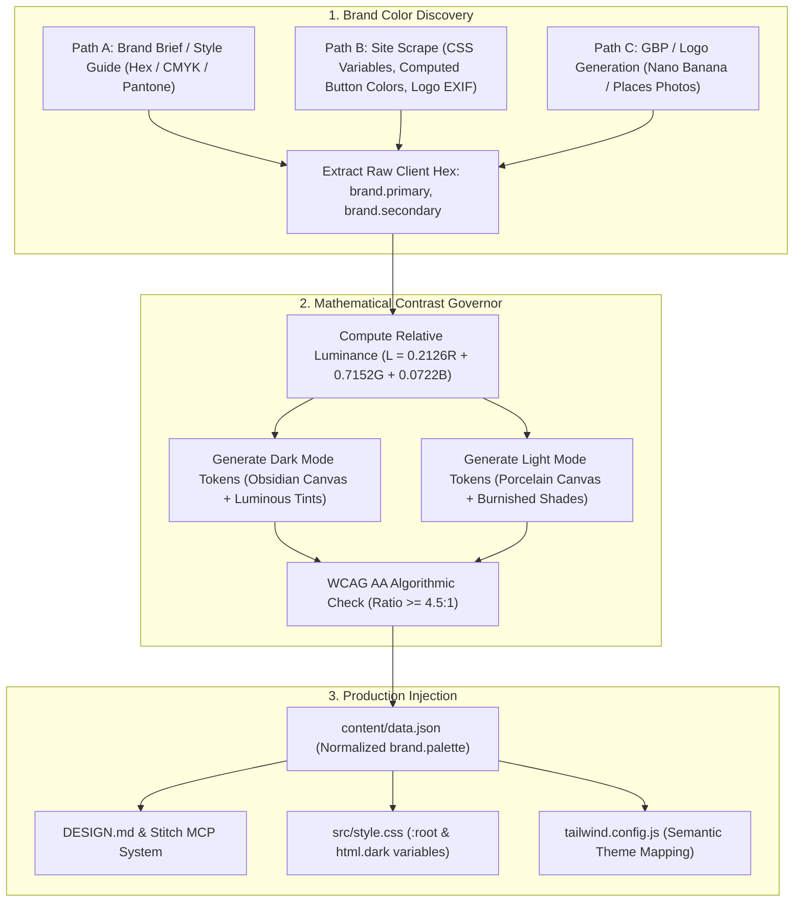

# Client Brand Palette & Dynamic Dual-Theme Architecture Blueprint

**Applies to**: All Client Web Builds, Rebuilds, and Rebrands  
**Governing Standard**: WCAG AA Compliance (4.5:1 text, 3:1 borders/large text) across both Light and Dark modes.

---

## 1. The Core Scalability Principle: Semantic Functional Tokens

The foundational mistake in single-project development is hardcoding brand-specific color names (e.g. `bg-charcoal-900`, `text-bronze-400`, `bg-blue-950`) into HTML templates. When a new client arrives with emerald, royal navy, terracotta, or amethyst brand colors, hardcoded templates require rewriting hundreds of class attributes and create contrast bugs.

### The Decoupled Token Standard
All client templates engineered by Eye Of Ru Enterprises use **Semantic Functional Roles**. The HTML markup remains 100% brand-agnostic:

```html
<!-- Clean, Brand-Agnostic HTML Component Pattern -->
<header class="bg-surface/90 border-b border-theme backdrop-blur-md">
  <nav class="text-secondary hover:text-accent">...</nav>
  <a href="#contact" class="bg-accent text-accent-contrast hover:bg-accent-hover">
    Initiate Consultation
  </a>
</header>

<div id="mobileMenu" class="bg-drawer border-b border-theme shadow-xl">
  <a href="#services" class="text-primary hover:text-accent">Services</a>
</div>
```

The visual identity is controlled entirely through CSS Custom Properties and Tailwind configuration, parameterized per client.

---

## 2. Dynamic Intake & Ingestion Pipeline



### Ingestion Details by Intake Channel
1. **Mode A (Brand Document / Brief Import)**:
   - Ingests verified client primary, secondary, and accent hex codes.
   - Captures client's default theme preference (Dark, Light, or Auto).
2. **Mode B (Existing Site Scrape & Rebuild)**:
   - The harvester script scans the client's current CSS files for root custom properties (e.g. `--primary-color`, `--brand-blue`, `color: ...`).
   - Identifies the dominant primary CTA button background color and the primary header text color.
   - Extracts exact palette to `content/data.json`.
3. **Mode C (Google Business Profile / No Website)**:
   - If the client has existing storefront signage or truck wrap imagery, extracts dominant colors via logo analysis.
   - If no brand assets exist, the agent presents **3 pre-calculated, industry-tailored WCAG AA palettes** during kickoff for client sign-off (e.g., *Sovereign Obsidian & Bronze*, *Executive Navy & Amber*, *Modern Slate & Emerald*).

---

## 3. The Mathematical Contrast Governor (Solving Arbitrary Client Colors)

Clients frequently supply brand colors that look great on paper or print business cards, but fail accessibility when dropped onto web canvases. The system runs an automated **Luminance & Contrast Split**:

$$\text{Relative Luminance } L = 0.2126 R + 0.7152 G + 0.0722 B$$
$$\text{Contrast Ratio } CR = \frac{L_1 + 0.05}{L_2 + 0.05}$$

### A. High-Luminance Client Colors (e.g., Gold, Yellow, Vibrant Coral, Neon Lime)
* **Client Input**: E.g., Electric Gold `#e5be7d` ($L \approx 0.53$) or Safety Yellow `#facc15` ($L \approx 0.65$).
* **Dark Mode Behavior**:
  * On Obsidian Canvas (`#07090b`, $L \approx 0.01$): Contrast ratio is **> 9:1**.
  * Use directly for text accents, badges, and illuminated borders.
* **Light Mode Inversion (The Shade Shift)**:
  * On White Canvas (`#ffffff`, $L = 1.0$): Contrast ratio is **~1.8:1 (FAIL)**.
  * **System Action**: Automatically shifts the color to its deep burnished shade (e.g. `#92400e` or `#8a5f22`, $L \approx 0.12$).
  * Result: **5.8:1+ contrast on white** with identical hue family.

### B. Low-Luminance Client Colors (e.g., Midnight Navy, Forest Green, Deep Crimson, Plum)
* **Client Input**: E.g., Deep Navy `#0f172a` ($L \approx 0.02$) or Forest Green `#14532d` ($L \approx 0.06$).
* **Light Mode Behavior**:
  * On White Canvas (`#ffffff`): Contrast ratio is **> 12:1**.
  * Use directly for primary headlines, text accents, and sharp borders.
* **Dark Mode Inversion (The Tint Shift)**:
  * On Obsidian Canvas (`#07090b`): Contrast ratio is **< 2:1 (FAIL)**.
  * **System Action**: Automatically shifts the color to its luminous ice/sky tint (e.g., `#38bdf8` or `#4ade80`, $L \approx 0.50$).
  * Result: **9:1+ contrast on dark canvas**.

---

## 4. Universal CSS Variable Token Architecture

Every client project generates this unified CSS variable block in `src/style.css`. When deploying for a new client, only the hex values inside these variables change; the entire frontend updates automatically:

```css
/* ==========================================================================
   DYNAMIC CLIENT BRAND SYSTEM: CSS CUSTOM PROPERTIES
   Populated automatically from content/data.json
   ========================================================================== */

/* LIGHT THEME (Default or Inverted) */
:root {
  /* Surfaces & Structural Canvases */
  --bg-canvas: #f8fafc;           /* Light porcelain / client canvas */
  --bg-surface: #ffffff;          /* Pure white card surfaces */
  --bg-surface-elevated: #f1f5f9; /* Elevated cards / tooltips */
  --bg-drawer: #ffffff;           /* Mobile drawer menu container */
  --bg-pill: #e2e8f0;             /* Telemetry / tag chips */

  /* Borders */
  --border-subtle: #e2e8f0;       /* Hairline dividers */
  --border-prominent: #cbd5e1;    /* Interactive borders */
  --border-accent: rgba(var(--client-accent-rgb), 0.35);

  /* Typography (WCAG AA Compliant >= 4.5:1) */
  --text-primary: #0f172a;        /* Deep obsidian headlines */
  --text-secondary: #334155;      /* Slate body copy */
  --text-muted: #64748b;          /* Muted metadata */

  /* Client Brand Accents (Calculated for Light Backgrounds) */
  --accent-primary: #92400e;      /* Inverted burnished shade (5.8:1+ contrast) */
  --accent-hover: #78350f;
  --accent-contrast-text: #ffffff;/* Text placed over filled accent buttons */
}

/* DARK THEME */
html.dark {
  /* Surfaces & Structural Canvases */
  --bg-canvas: #07090b;           /* Obsidian / deep brand slate */
  --bg-surface: #0d0f12;          /* Primary card surface */
  --bg-surface-elevated: #13161b; /* Elevated cards / modal bodies */
  --bg-drawer: #0d0f12;           /* Mobile drawer menu container */
  --bg-pill: #13161b;             /* Telemetry / tag chips */

  /* Borders */
  --border-subtle: #1a1e24;
  --border-prominent: #282e38;
  --border-accent: rgba(var(--client-accent-rgb), 0.4);

  /* Typography (WCAG AA Compliant >= 4.5:1) */
  --text-primary: #f8fafc;        /* Crisp white headlines */
  --text-secondary: #cbd5e1;      /* Light slate body copy */
  --text-muted: #94a3b8;          /* Muted metadata */

  /* Client Brand Accents (Calculated for Dark Backgrounds) */
  --accent-primary: #e5be7d;      /* Luminous gold / brand tint (9.8:1 contrast) */
  --accent-hover: #f6d8a8;
  --accent-contrast-text: #07090b;/* Text placed over filled accent buttons */
}
```

---

## 5. Tailwind Configuration Bridge (`tailwind.config.js`)

By binding Tailwind color keys to CSS custom properties, utility classes map to semantic tokens automatically:

```javascript
/** @type {import('tailwindcss').Config} */
export default {
  darkMode: 'class',
  content: ["./index.html", "./src/**/*.{js,ts,jsx,tsx,html}"],
  theme: {
    extend: {
      colors: {
        canvas: 'var(--bg-canvas)',
        surface: {
          DEFAULT: 'var(--bg-surface)',
          elevated: 'var(--bg-surface-elevated)',
          drawer: 'var(--bg-drawer)',
          pill: 'var(--bg-pill)'
        },
        theme: {
          border: 'var(--border-subtle)',
          'border-prominent': 'var(--border-prominent)'
        },
        brand: {
          primary: 'var(--accent-primary)',
          hover: 'var(--accent-hover)',
          contrast: 'var(--accent-contrast-text)'
        }
      }
    }
  }
}
```

---

## 6. Pre-Flight Visual Contrast Gate for New Clients

Whenever an agent builds a new client site or rebuild:
1. Harvest brand colors to `content/data.json`.
2. Compute Dark and Light variants using the Mathematical Contrast Governor.
3. Inject the CSS variables into `src/style.css`.
4. Capture dual-theme responsive screenshots (`light-desktop-1440px.png`, `light-mobile-menu-390px.png`, `dark-mobile-menu-390px.png`).
5. Run `Invoke-PreflightAudit.ps1` to mechanically verify contrast and 0 unreadable elements before presenting to the client.
