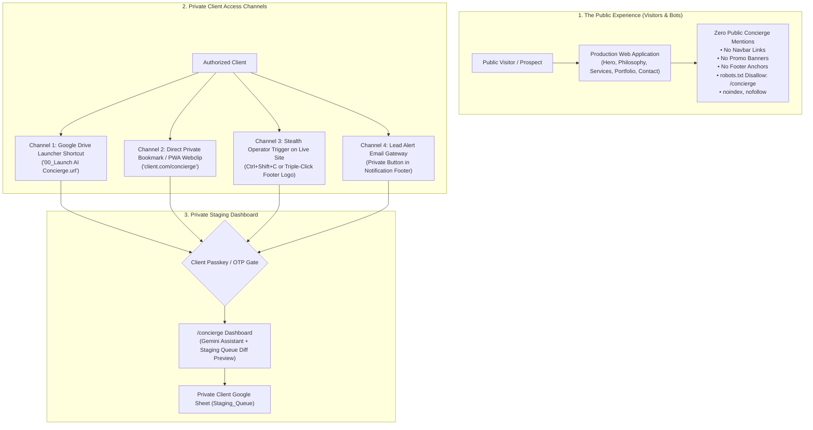

# Strategic Plan: Client-Only AI Concierge Access Architecture

**Studio Venture**: Eye Of Ru Enterprises, LLC  
**Component**: Client AI Concierge Dashboard (`/concierge`) & Staging Queue  
**Principle**: Zero Public Footprint, 100% Client-Only Convenience, Stealth Operator Access  

---

## Executive Overview

The **Client AI Concierge** is an air-gapped operational staging dashboard where authenticated business owners converse with an AI assistant to propose website modifications, review live diff previews, and submit updates to their agency staging queue.

**The Problem**: Exposing `/concierge` links in public navigation bars, promotional marketing banners, or footer link lists:
1. Clutters the visitor acquisition funnel with internal tooling.
2. Invites curious public visitors and malicious scrapers to probe private AI endpoints.
3. Confuses prospective customers who are not yet active clients.

This plan details how to **completely eliminate all public-facing links to `/concierge`** while making access effortless, fast, and intuitive for legitimate clients.

---

## 1. Architectural Philosophy: The Three-Tier Isolation Model



---

## 2. The 4 Friction-Free Client Access Pathways

Rather than forcing the client to navigate a public menu, we provide **four natural, private access pathways**:

### Pathway A: Permanent Google Drive Workspace Shortcut (`00_Launch AI Concierge.url`)
* **How It Works**:
  * Every Eye Of Ru client receives a dedicated, private Google Drive directory:  
    `Eye Of Ru Enterprises / Clients / [Client Name] /`
  * Right at the top of the root folder, we provision an interactive launcher shortcut file:  
    `00_Launch AI Concierge.url` (or a Google Doc launcher).
  * Double-clicking this file in Google Drive opens their private Concierge workspace instantly in a new tab.
* **Why Clients Love It**:
  * Clients already visit this folder daily to view their `Leads` spreadsheet and brand assets. Having the Concierge launcher in their primary operational folder feels completely native.

### Pathway B: Direct Private Bookmark & PWA Mobile Home Screen Webclip
* **How It Works**:
  * Delivered in the private onboarding welcome packet:  
    `https://client.com/concierge` (or a dedicated client subdomain `https://concierge.client.com`).
  * Optimized with PWA meta tags (`apple-mobile-web-app-capable`, standalone display mode).
  * The business owner can tap **"Add to Home Screen"** on their iPhone or Android device, creating a dedicated app icon labeled **"Studio Concierge"** on their phone.
* **Security & Obscurity**:
  * Carries `<meta name="robots" content="noindex, nofollow">`.
  * Excluded from `sitemap.xml`.
  * Blocked in `robots.txt` (`Disallow: /concierge`).
  * Zero public links point to this route.

### Pathway C: The "Stealth Operator Trigger" (Hidden In Plain Sight)
Business owners frequently browse their own live website. We can empower them to summon their Concierge directly from their live site using one of three unadvertised stealth triggers:

1. **Discreet Keystroke Shortcut**:
   * Pressing `Ctrl + Shift + C` (or `Alt + K`) on any page immediately slides out the Concierge drawer or redirects to `/concierge`.
2. **Subtle Logo Triple-Click**:
   * Triple-clicking the copyright seal or emblem in the footer brings up a discreet modal:  
     `Client Operator Passcode: [________]`
   * Entering the client passphrase immediately unlocks the Concierge.
3. **Secret URL Session Token (`?operator=1`)**:
   * Visiting `https://client.com/?operator=ru` sets `localStorage.setItem('studio_operator', 'true')`.
   * For that browser *only*, a discreet floating management tab appears in the bottom corner. For all other visitors across the globe, it is 100% invisible.

### Pathway D: Transactional Lead Notification Digest Button
* **How It Works**:
  * When a visitor submits a contact inquiry, our Google Apps Script webhook dispatches an immediate email alert to the client.
  * In the footer of that private email, we include an authorized action button:  
    `[ Request Site Update via AI Concierge ]`
  * Clicking this button opens their private Concierge session directly.

---

## 3. Search Engine & Scraper Defense

To guarantee that `/concierge` remains strictly unindexed by search engines and invisible to public web scrapers:

1. **Meta Directives**:
   ```html
   <meta name="robots" content="noindex, nofollow, noarchive, nosnippet">
   ```
2. **Robots Directives (`robots.txt`)**:
   ```http
   User-agent: *
   Disallow: /concierge
   Disallow: /concierge.html
   ```
3. **Sitemap Sanitation**:
   * Confirm that `sitemap.xml` only indexes the core public pages (`/`, `/#thesis`, `/#ventures`, `/#disciplines`, `/#contact`, `/privacy`, `/terms`).
   * Never include `/concierge` in any sitemap.

---

## 4. Implementation Steps for Eye Of Ru Workspace

To align our current workspace with this new standard:

1. **Cleanse `index.html` & `dist/index.html`**:
   * Remove the public promo section: `CONTRACTED ADD-ON: AI CONCIERGE PROMO BANNER` (lines 577–600).
   * Remove the public footer link: `<a href="/concierge">Client AI Concierge (/concierge)</a>` (line 737).
2. **Implement Stealth Operator Trigger in `index.html`**:
   * Add a discreet keyboard listener (`Ctrl + Shift + C`) and footer emblem triple-click listener that redirects to `/concierge` or opens the concierge drawer.
3. **Protect `/concierge.html`**:
   * Verify `<meta name="robots" content="noindex, nofollow">` is present in `/concierge.html`.
4. **Update `robots.txt`**:
   * Add `Disallow: /concierge` and `Disallow: /concierge.html`.
5. **Codify into Production Templates & Rules**:
   * Ensured future subagents and developers will never place public concierge links on client websites.

---

## Summary Comparison

| Access Vector | Legacy Approach | New Sovereign Standard |
| :--- | :--- | :--- |
| **Main Navigation** | Often linked as a menu item | **Strictly Forbidden (0% Public Footprint)** |
| **Landing Page Content** | Promo banner advertising concierge | **Removed (Replaced with customer-focused copy)** |
| **Footer Links** | Public text link in quick access | **Removed (Clean governance only)** |
| **Client Access** | Public link on site | **Google Drive Shortcut + PWA Bookmark + Stealth Trigger** |
| **Search Indexing** | Risk of indexing | **Strict `noindex, nofollow` + `robots.txt` Disallow** |
| **Security Layer** | Open to public clicks | **Passkey / OTP Gate / Private Direct Routing** |
