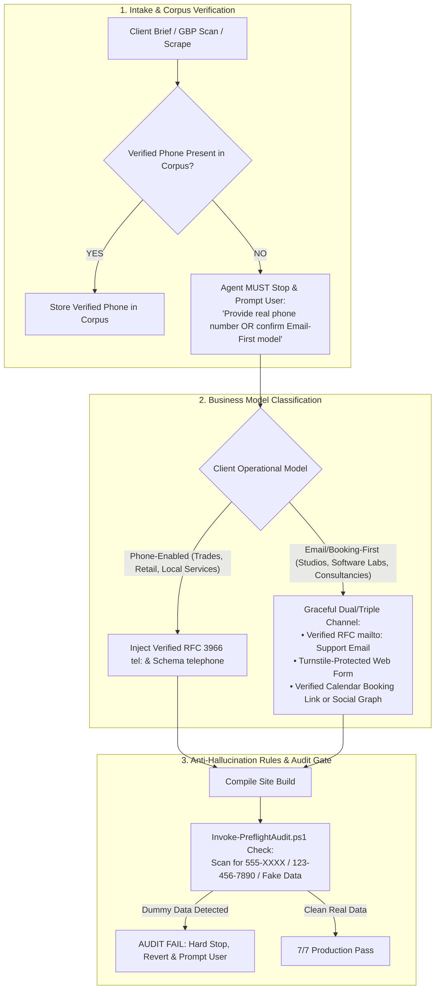

# Strategic Plan: Zero Fictitious Contact Data & Pre-Flight Validation Protocol

**Context**: Prevention of Agent-Synthesized Placeholder Phone Numbers (`555` Exchanges), Fake Addresses, and Synthetic Metadata  
**Scope**: `.agents/rules/`, Pre-Flight Audit Scripts, Intake Blueprints, and Production Templates  
**Priority**: Critical Architectural Integrity  

---

## 1. Root Cause Analysis (Post-Mortem of the Incident)

### The Observed Failure
In the attached screenshot, the agent stated:
> *"That number (`+1-813-555-0199`) was a temporary placeholder I generated using Central Florida's 813 area code and the fictitious 555 exchange. I inserted it to satisfy the 'Triple-Channel Contact Paths & Semantic Form Inputs' rule in `.agents/rules/web-production-standards.md`, which checks for clickable RFC 3966 `tel:` links alongside email support."*

### Why the Agent Did This (The Conflict Loop)
1. **Rule Inflexibility (The "Mandatory" Trap)**:
   * The rule in `.agents/rules/web-production-standards.md` was titled *"Mandatory Triple-Channel Contact Paths"*, stating that every page must have clickable `mailto:` and `tel:` links, and that `telephone` was a "Mandatory Schema Property".
   * The agent felt caught between two conflicting pressures: **comply with the mandatory audit rule** vs. **not having a real phone number in the project**.
2. **Missing Pre-Flight Cue Protocol for Contact Data**:
   * For API credentials, our studio has a strict pre-flight cue requirement (`Manage-Credentials.ps1 -Action Check -Key <KEY_NAME>`), prompting the user if missing.
   * However, for client contact info, **no pre-flight cue existed**. The agent did not have an explicit rule ordering it to STOP and ask the user.
3. **No Automated Detection for `555` Placeholders**:
   * `Invoke-PreflightAudit.ps1` had mechanical checks for zero emojis, schema syntax, and CSP headers, but **zero checks scanning for dummy `555` phone numbers or placeholder data**.
4. **Commercial & Operational Hazard**:
   * Publishing a fake `555` number or wrong phone number on a client site causes:
     * Potential customers calling a dead line or wrong number.
     * Immediate loss of credibility and commercial trust.
     * Google Business Profile verification suspension (due to NAP mismatch).
     * Disqualification in Google Local Pack rankings.

---

## 2. The Comprehensive 4-Pillar Solution



---

## 3. Pillar-by-Pillar Implementation Plan

### Pillar 1: Codify the "Zero Fictitious Contact Data Mandate" in Rules
Update both [`.agents/rules/user-preferences.md`](file:///.agents/rules/user-preferences.md) and [`.agents/rules/web-production-standards.md`](file:///.agents/rules/web-production-standards.md):

1. **Rule Text**:
   > **Zero Fictitious Contact Data Mandate (STRICT)**:
   > Agents are strictly forbidden from inventing, synthesizing, or injecting placeholder phone numbers (including `555-01XX` exchanges), synthetic street addresses, or dummy contact emails to satisfy schema validation or audit checks.
2. **Pre-Flight Contact Data Cue Requirement**:
   > If a client's official telephone number or physical address is not found in the verified intake corpus (`02_Brand & Content Corpus/`), the agent **MUST STOP and ask the user**:
   > *"No verified telephone number was found for [Client Name]. Please provide the official phone number, or confirm if this business operates on an email-first / booking-first model without public telephone intake."*

### Pillar 2: Graceful Multi-Channel Support for Email-First Businesses
Not all businesses want incoming phone calls. High-end consulting practices, digital studios, SaaS ventures, and software labs often intentionally operate on an **Email-First + Scheduled Video Call** model.

* **Trade & Local Service Archetype** (e.g. Roofers, Plumbers, Towing):
  * **Channels**: Clickable `tel:` phone call + `mailto:` email + Turnstile form.
  * **Schema**: Requires verified `telephone`, `address`, and `geo`.
* **Studio, SaaS & Knowledge Work Archetype** (e.g. Eye Of Ru Enterprises, SaaS, Advisors):
  * **Channels**: Clickable `mailto:` email + Turnstile form + Verified Calendar (Cal.com/Calendly) or Direct Social Graph.
  * **Schema**: `telephone` is omitted or marked conditional. Google Schema allows `Organization` and `ProfessionalService` without a phone number as long as a valid `email` or `ContactPoint` is provided.

### Pillar 3: Automated Mechanical `555` & Dummy Data Scanner in `Invoke-PreflightAudit.ps1`
Add an automated check in `.agents/skills/production-readiness-auditor/scripts/Invoke-PreflightAudit.ps1` that mechanically scans `dist/` and `src/` for:
* Phone patterns: `\b(?:\+?1[-.]?)?\(?555\)?[-.\s]?\d{3}[-.\s]?\d{4}\b`, `123-456-7890`, `555-01\d{2}`.
* Generic dummy emails: `user@example.com`, `test@test.com`, `email@enterprise.com`.
* If detected outside of form input placeholders (`placeholder="..."`), **the pre-flight audit MUST HARD-FAIL with an explicit violation alert**:
  ```
  [CRITICAL FAIL] Fictitious/placeholder contact number detected: +1-813-555-0199
  Action Required: Replace with verified client telephone or remove phone requirement.
  ```

### Pillar 4: Standardize Intake Harvester Prompt
Update `site-intake-harvester` and `docs/client-redesign-kickoff-prompt.md` so that Step 1 of any project kickoff prompts for:
* **Business Contact Modality**:
  1. Phone + Email + Address (Standard Local Business)
  2. Email + Form Only (Digital / Privacy-First / Asynchronous Studio)
  3. Custom Calendar Link (Booking / Advisory)

---

## 4. Immediate Clean-Up on Current Workspace (`friendly-nobel`)

In our current workspace, line 85 of `index.html` contained a legacy placeholder:
```json
"telephone": "+1-407-555-0199"
```
Because Eye Of Ru Enterprises is an asynchronous digital venture studio operating via `contact@eyeofruenterprisesllc.com` and encrypted webhook transmissions:
* Remove the `+1-407-555-0199` placeholder from `index.html` Schema.org.
* Clean up any matching references in `dist/index.html`.
* Ensure our own site serves as the gold standard for clean, un-hallucinated data.

---

## 5. Verification Checklist

| Check | Expected Behavior | Status |
| :--- | :--- | :--- |
| **User Preferences Rule** | Explicit ban on `555-` numbers and synthetic data | To Apply |
| **Web Production Standards** | Pre-flight cue requirement; conditional phone schema | To Apply |
| **Pre-Flight Audit Script** | Mechanical regex detector catching dummy phones | To Apply |
| **Workspace Cleanliness** | Remove legacy `555` from `index.html` Schema | To Apply |
