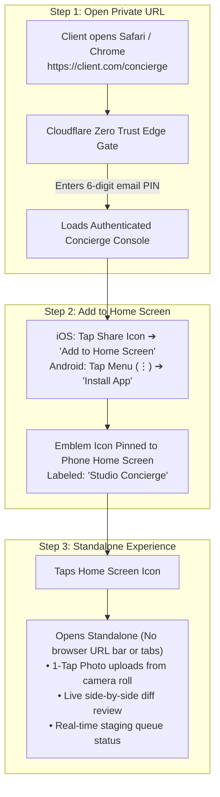

# Eye Of Ru Enterprises — Client Onboarding & Mobile PWA Webclip Protocol

**Target Audience**: Executive Business Owners & Authorized Venture Partners  
**Subject**: Private AI Concierge & Staging Dashboard Setup  
**Estimated Setup Time**: Under 60 seconds  

---

## Executive Overview

Every Eye Of Ru partner receives access to the private **AI Concierge & Staging Queue** (`/concierge`). To give business owners instant, one-tap access without cluttering public navigation bars or requiring app store downloads, the dashboard is engineered as a **Progressive Web Application (PWA) Webclip**.

This protocol details:
1. **Pre-Flight Provisioning** (Agency Engineering Checklist).
2. **The Executive Welcome Email Kit** (Template sent to client).
3. **Step-by-Step Mobile Installation** (iOS Safari & Android Chrome).
4. **Security & Session Lifecycle** (How Zero Trust OTP guards the mobile app).

---

## 1. Agency Pre-Flight Checklist (Prior to Sending Onboarding Kit)

Before dispatching the onboarding kit to the business owner, agency engineering completes:

- [ ] **Cloudflare Zero Trust Allowlist**: Add client executive email(s) (e.g. `owner@clientdomain.com`) to the Cloudflare Access policy for `/concierge*`.
- [ ] **Google Drive Hierarchy Verification**: Confirm client folder exists:
  - `Eye Of Ru Enterprises / Clients / [Client Name] /`
  - `00_Launch AI Concierge.url` (Double-click launcher in Drive root)
  - `02_Brand Assets & Media/`
  - `03_Data & Lead Sheets/` (`[Client Name] — Operational Data & Leads`)
- [ ] **Webhook Validation**: Confirm `Staging_Queue` and `Leads` sheets are responsive via `gas-drive-ingestion`.
- [ ] **PWA Meta Tags**: Confirm `/concierge.html` serves standalone display headers and 180×180 Apple touch icons.

---

## 2. Executive Welcome Transmission Template

*Sent from: `agency@eyeofruenterprisesllc.com`*  
*To: `owner@clientdomain.com`*  
*Subject: `[WELCOME] Your Sovereign Studio Concierge & Live Staging Portal`*

```markdown
Dear [Client First Name],

Welcome to Eye Of Ru Enterprises. 

Your website infrastructure and private staging console are active. To make requesting updates, swapping photography, and reviewing live inquiries effortless, we have provisioned your private AI Concierge.

### 🔐 Your Private Access Credentials
* **Console URL**: https://[clientdomain.com]/concierge
* **Access Level**: Executive Partner (Air-Gapped Staging Queue)
* **Authentication**: One-Time Passcode (OTP) sent directly to your email on demand (Zero passwords required)

---

### 📱 30-Second Mobile Home Screen Setup (One-Tap Access)
You can install your Concierge as a standalone mobile app directly on your smartphone in 3 steps:

#### For iPhone / iPad (Apple Safari):
1. Open https://[clientdomain.com]/concierge in **Safari**.
2. Tap the **Share** button (the square with an arrow pointing upward at the bottom of the screen).
3. Scroll down and tap **"Add to Home Screen"** (+ icon).
4. Name it **"Studio Concierge"** and tap **Add** in the top right.
✓ An emblem icon will appear on your iPhone home screen. Tapping it opens full-screen without address bars or browser menus.

#### For Android (Google Chrome):
1. Open https://[clientdomain.com]/concierge in **Chrome**.
2. Tap the **three vertical dots (⋮)** in the top right corner.
3. Tap **"Install app"** or **"Add to Home screen"**.
4. Confirm by tapping **Add**.
✓ The standalone app is now installed on your Android home screen and app drawer.

---

### 💻 Desktop Access Pathway
If you are at your desk, you can also launch your Concierge with a single click directly from your master Google Drive folder:
👉 Double-click `00_Launch AI Concierge.url` inside your shared Google Drive directory.

Should you need any assistance, hit Reply to this email or reach us directly at agency@eyeofruenterprisesllc.com.

With sovereign regard,

Eye Of Ru Enterprises, LLC
Autonomous Engineering & Venture Studio
```

---

## 3. Visual Mobile Installation Walkthrough



---

## 4. Why This Approach is Superior to App Stores

| Dimension | Native App Store (iOS / Android) | Eye Of Ru PWA Webclip |
| :--- | :--- | :--- |
| **Setup Friction** | Client must download 50MB app from App Store, create accounts, deal with updates | **30 seconds**; zero downloads, zero account setup |
| **Security & Privacy** | Publicly visible in App Store search | **100% Private & Invisible**; unindexed, no public footprint |
| **Edge Protection** | Third-party push servers | Protected directly by **Cloudflare Zero Trust OTP** |
| **Instant Updates** | Weeks of Apple App Store review delays | Instant updates deployed live to the edge in seconds |
| **Full Screen Feel** | Native UI | **Native Standalone Mode** with zero browser address bars |
