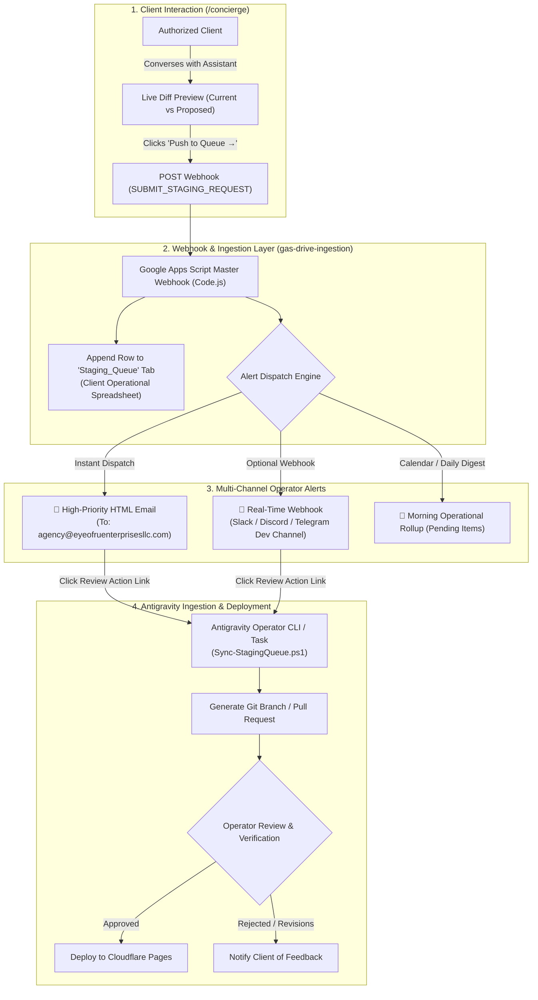
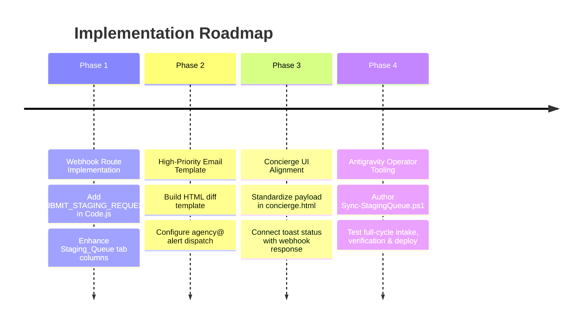

# Architectural Plan: AI Concierge Update Queue & Approval Notification System

**Studio Venture**: Eye Of Ru Enterprises, LLC  
**Component**: Client AI Concierge (`/concierge`) → Staging Queue → Operator Notification & Approval Pipeline  
**Design Principles**: Air-Gapped Safety, Zero Silent Requests, Sovereign Multi-Channel Delivery, Frictionless Antigravity Sync  

---

## 1. Executive Summary

When an authorized client interacts with the **AI Concierge** (`/concierge`), the assistant generates structured, side-by-side diff proposals (covering copy, business hours, venture articles, and UI styling). When the client clicks **"Push to Queue →"**, this modification must never touch the live production branch directly. 

Instead, it enters an **air-gapped human-in-the-loop staging queue**. To ensure rapid turnaround without requiring operators to manually poll spreadsheets, we require an **active notification and triage architecture** that alerts the Eye Of Ru engineering team the exact second a modification is queued.

---

## 2. Notification Dispatch Channels & Architecture

To satisfy both immediate situational awareness and asynchronous triage, we specify a **three-tier alert architecture**:

| Channel | Trigger Velocity | Recipient | Content Payload | Action Pathway |
| :--- | :--- | :--- | :--- | :--- |
| **Tier 1: Sovereign Email Dispatch** *(Primary)* | Immediate (< 3s) | `agency@eyeofruenterprisesllc.com` | High-contrast visual HTML diff table, client rationale, target section/field, submission metadata | One-click button to Google Sheet, one-click Antigravity intake terminal command |
| **Tier 2: Real-Time Chat Webhook** *(Secondary)* | Immediate (< 1s) | Discord / Slack / Telegram internal channel | Formatted markdown embed with colored status indicator, client name, and change summary | Link to sheet & review queue |
| **Tier 3: Daily Queue Digest / Rollup** *(Fail-Safe)* | Scheduled (08:00 EST daily) | Studio Executive Inbox | Digest of any items still in `PENDING_REVIEW` state over 12 hours old | Summary of unresolved queues across all client ventures |

---

## 3. High-Priority Email Notification Design (`agency@`)

The primary alert channel uses Google Apps Script's native `sendAgencyEmail` mechanism (sent from `agency@eyeofruenterprisesllc.com`). 

### Email Specification
* **Subject Format**:  
  `[STAGING APPROVAL REQUIRED] {Client Name} — {Target Section} ({Field})`
* **Preheader**:  
  `New site adjustment staged by {Client Name} awaiting Antigravity operator approval.`
* **Visual Diff Embed**:  
  A custom inline CSS card rendering the **Current Baseline** in soft crimson (`#ef4444`) and the **Proposed Modification** in emerald (`#10b981`), mirroring the Concierge UI.
* **Direct Operator Actions**:
  1. **"Inspect in Google Sheet"** (Direct link to the client's `Staging_Queue` tab).
  2. **"Open Client Concierge"** (Direct inspection on live site).
  3. **"Antigravity CLI Command"** (Pre-formatted copyable command to fetch and stage the change locally).

---

## 4. Google Apps Script Webhook Pipeline (`gas-drive-ingestion/Code.js`)

To implement this notification architecture, we update `gas-drive-ingestion/Code.js` to add the dedicated `SUBMIT_STAGING_REQUEST` (and backward-compatible `STAGE_UPDATE`) handler.

### Ingestion Logic:
1. **Extract & Sanitize Payload**:
   * `clientName` (or `clientId`)
   * `targetSection` (e.g. `Header Navigation`, `Operating Schedule`, `Ventures Catalog`, `Hero Section`)
   * `field` (e.g. `Branding Title & Visual Effects`, `Friday Hours`, `New Venture Title`)
   * `currentValue`
   * `proposedValue`
   * `clientRationale`
   * `submittedBy` (client email or operator ID)
2. **Append to `Staging_Queue` Tab**:
   * Columns: `[Timestamp, Client Name, Target Section, Field, Current Value, Proposed Value, Status, Client Rationale, Submitted By, Approval Notes]`
   * Default Status: `PENDING_REVIEW`
3. **Trigger Email Notification**:
   * Calls `sendAgencyEmail(...)` to dispatch the formatted HTML notification.
4. **Trigger Optional Chat Webhook**:
   * If a Discord/Slack webhook URL is stored in Script Properties (`CHAT_WEBHOOK_URL`), dispatches an instant JSON payload with embed.
5. **Return Operational Response**:
   * Returns `{ status: "SUCCESS", queueId: "...", spreadsheetUrl: "..." }`.

---

## 5. Antigravity Local Operator Workflow (`Sync-StagingQueue.ps1`)

To bridge the air-gap into local development and verification:

1. **PowerShell Sync Script** (`scripts/Sync-StagingQueue.ps1`):
   * Queries the webhook via `action: "GET_STAGING_QUEUE"`.
   * Displays all `PENDING_REVIEW` items in terminal with colorized diffs.
   * Prompts the operator: `[A]pprove & Apply Patch | [R]eject | [S]kip`.
2. **Patch Application**:
   * If approved, Antigravity generates a feature branch (`stage/client-update-{timestamp}`) and replaces target code in `index.html` or target content files.
   * Runs local preflight validation (`npm run build`).
   * Marks the row in Google Sheet as `VERIFIED` or `DEPLOYED`.
3. **Closing the Loop (Client Notification)**:
   * Once deployed to Cloudflare Pages, a webhook or email can notify the client:
     *"Your requested adjustment has been approved and deployed to production."*

---

## 6. Implementation Phases & Milestones

