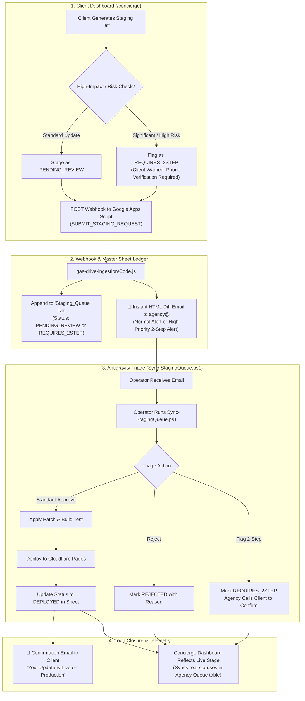

# Architectural Plan: AI Concierge Update Queue & Approval Notification System (V2)

**Studio Venture**: Eye Of Ru Enterprises, LLC  
**Component**: Client AI Concierge (`/concierge`) → Staging Queue → Operator Notification & Approval Pipeline  
**Design Principles**: Air-Gapped Safety, Zero Silent Requests, Sovereign Email Delivery, Dynamic Status Reflection, 2-Step Verification for High-Impact Updates  

---

## 1. Executive Summary & User Decisions

Following operator review, the notification and approval architecture is specified as follows:

1. **Email as Exclusive Notification Channel**: High-contrast visual HTML diff alerts delivered instantly via `agency@eyeofruenterprisesllc.com`.
2. **Local Antigravity Operator Tooling (`Sync-StagingQueue.ps1`)**: Native PowerShell utility to pull, inspect colorized terminal diffs, and approve/flag/reject queued proposals directly in the IDE.
3. **Two-Way Feedback & Live Concierge Panel Reflection**:
   - When updates are deployed, automated confirmation emails dispatch to the client.
   - The Concierge UI (`/concierge.html`) dynamically queries and renders the live staging queue stages (`PENDING_REVIEW`, `UNDER_REVIEW`, `REQUIRES_2STEP`, `DEPLOYED`, `REJECTED`).
4. **Risk-Based 2-Step Verification (`REQUIRES_2STEP` / `UNDER_REVIEW`)**:
   - Significant, high-impact, or unusual updates (e.g. rate changes, routing, legal terms, major redesigns) trigger automated or operator-flagged 2-step verification (agency phone confirmation required before deployment).



---

## 2. Risk Heuristics & 2-Step Verification System

To protect client businesses against accidental misconfigurations, unauthorized employee submissions, or critical disruptions:

### A. Automatic Risk Heuristic Triggers
The Concierge and Webhook evaluate the submission against high-impact heuristics:
* **Financial & Pricing Changes**: Hourly rates, package fees, retainers, pricing disclaimers.
* **Operating Hours Disruption**: Schedule cuts greater than 50% or marked as "Closed indefinitely".
* **Contact & Telemetry Routing**: Phone numbers, inquiry notification emails, physical business addresses.
* **Structural Architecture**: Deleting entire portfolio items, major headline overhauls, or code diffs exceeding 500 characters.

### B. Status Lifecycle
| Status Code | Badge Color | Meaning & Operator Protocol |
| :--- | :--- | :--- |
| `PENDING_REVIEW` | Amber (`#f59e0b`) | Standard proposal queued. Normal engineering review in Antigravity. |
| `UNDER_REVIEW` | Indigo (`#6366f1`) | Operator is currently evaluating code compatibility or design impact. |
| `REQUIRES_2STEP` | Rose / Alert (`#f43f5e`) | High-impact modification. Operator must contact business owner via verified phone call before releasing. |
| `DEPLOYED` | Emerald (`#10b981`) | Verified, tested, and live on Cloudflare Pages production. |
| `REJECTED` | Muted Red (`#94a3b8`) | Discarded with feedback logged in the sheet. |

---

## 3. High-Priority Email Notification Specification

Dispatched via `sendAgencyEmail` from `agency@eyeofruenterprisesllc.com`:

* **Standard Subject**:  
  `[STAGING APPROVAL REQUIRED] {Client Name} — {Target Section} ({Field})`
* **2-Step Verification Subject**:  
  `🚨 [ACTION REQUIRED: 2-STEP CLIENT CALL] {Client Name} — {Target Section} ({Field})`
* **Diff Preview**:
  - Embedded side-by-side HTML comparison (Current Baseline vs. Proposed Value).
  - Prominent banner if flagged for 2-step verification:  
    `⚠️ SENSITIVE CHANGE DETECTED: Agency phone confirmation with authorized client required prior to release.`
* **Metadata**: Client name, target section, field, submitter identity, timestamp, client prompt/rationale.
* **Direct Links**: Link to client Google Sheet `Staging_Queue` tab + Concierge inspector.

---

## 4. Concierge Panel Dynamic Stage Reflection (`concierge.html`)

Currently, `concierge.html` displays hardcoded placeholder rows in the **Agency Queue** table.

### Upgrades:
1. **Dynamic Queue Fetching**:
   - On initial page load (and on "Force Sync ↻"), `concierge.html` calls the webhook:  
     `GET ?action=GET_STAGING_QUEUE&clientName={Client Name}`
   - Renders the live rows with color-coded status badges:
     - `PENDING_REVIEW` (amber)
     - `UNDER_REVIEW` (blue/indigo)
     - `REQUIRES_2STEP` (rose with phone icon)
     - `DEPLOYED` (emerald checkmark)
     - `REJECTED` (gray)
2. **Immediate Local Stage Optimistic Update**:
   - When the user pushes to queue, it immediately appends with `PENDING_REVIEW` (or `REQUIRES_2STEP` if flagged by heuristics) with an active pulse indicator.
3. **High-Impact Caution Toast**:
   - If the proposal was flagged as high-impact, display an informational warning:  
     *"Proposal staged. Due to the sensitive nature of this update, agency engineering will conduct a 2-step verification call before publishing."*

---

## 5. Local Antigravity Operator Tooling (`Sync-StagingQueue.ps1`)

A native PowerShell operator script located at `scripts/Sync-StagingQueue.ps1`:

### Operator Command Interface:
```powershell
.\scripts\Sync-StagingQueue.ps1 -Client "Eye Of Ru Enterprises"
```

### Capabilities:
1. **Pulls Queue**: Fetches all rows from `Staging_Queue` via webhook.
2. **Interactive Terminal Diff**: Renders current vs. proposed values with ANSI color highlights.
3. **Interactive Menu**:
   - `[A] Approve & Apply`: Updates local files, creates branch, runs `npm run build`, marks status as `DEPLOYED` via webhook.
   - `[2] Flag 2-Step`: Updates status to `REQUIRES_2STEP` and prompts for operator verification notes.
   - `[U] Mark Under Review`: Updates status to `UNDER_REVIEW`.
   - `[R] Reject`: Updates status to `REJECTED` and inputs rejection rationale.
   - `[S] Skip`: Continues to next item.
4. **Client Notification Trigger**:
   - Upon marking `DEPLOYED`, automatically triggers client confirmation email.

---

## 6. Execution Roadmap & Tasks

1. **Step 1: Webhook Update (`gas-drive-ingestion/Code.js`)**:
   - Implement `SUBMIT_STAGING_REQUEST` and `GET_STAGING_QUEUE` actions.
   - Implement `UPDATE_STAGING_STATUS` action.
   - Add risk-heuristic auto-detection (`REQUIRES_2STEP`).
   - Implement email dispatch with standard & 2-step alert templates.
   - Implement client deployment confirmation email dispatch.
2. **Step 2: Concierge UI Upgrade (`concierge.html`)**:
   - Update `approveDiff()` to dispatch structured payload and detect sensitive updates.
   - Implement `loadStagingQueue()` to fetch and render live stages dynamically from Google Sheet.
   - Wire "Force Sync ↻" button to refresh live queue.
3. **Step 3: Operator Script Authoring (`scripts/Sync-StagingQueue.ps1`)**:
   - Create interactive PowerShell intake and triage utility.
4. **Step 4: End-to-End Testing & Verification**:
   - Test standard change submission.
   - Test sensitive/high-risk change (triggers 2-step alert).
   - Test queue refresh in `concierge.html`.
