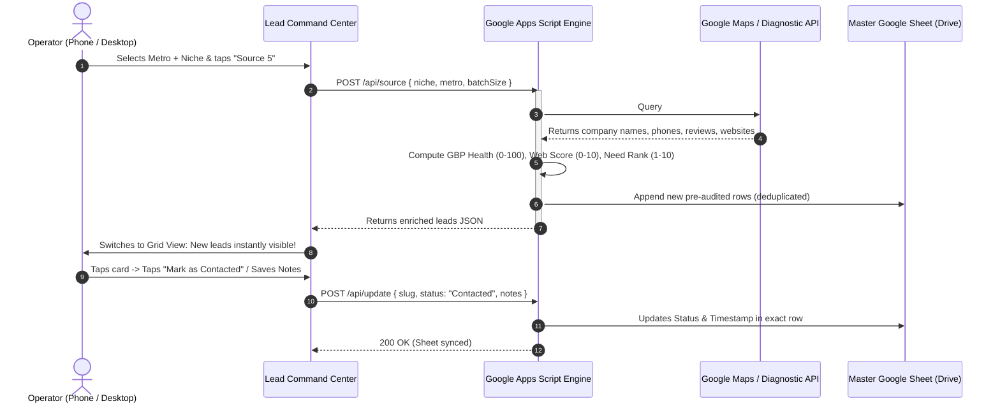

# Harmonious Architecture Plan: Dashboard Automator, GAS Lead Engine & Master Google Sheet

## System Overview
This ecosystem operates as a **closed-loop, serverless prospecting machine**:
1. **Frontend Command Center (Dashboard)**: The user interface on your phone/desktop for triggering jobs, reviewing cards, and executing 1-tap outreach.
2. **Worker Engine (Google Apps Script / GAS)**: The cloud brain that executes queries, enriches company data, and runs website diagnostics.
3. **Master Database (Google Sheet in Drive)**: The single source of truth storing all records, pipeline stages, phone numbers, and notes permanently.

---

## The End-to-End Workflow



---

## Component Roles & Data Flow Breakdown

### 1. Market Sourcing Automator (In Dashboard)
- **Role**: Trigger & Command.
- **Location**: Your phone or laptop browser.
- **How it works**:
  - You pick a metro and trade (e.g., *Tampa Bay • Commercial Roofing*) or tap a 1-click regional hotspot.
  - Sends a secure lightweight JSON payload to your GAS Web App URL:
    ```json
    {
      "action": "SOURCE_LEADS",
      "metro": "Tampa Bay, FL",
      "niche": "Commercial Roofing",
      "batchSize": 5,
      "minReviews": 5,
      "maxRank": 15
    }
    ```
  - Shows a clean progress indicator (`Sourcing & Enriching...`) without freezing the UI.

---

### 2. Lead Generator & Enrichment Engine (In Google Apps Script)
- **Role**: Headless Automated Worker & Auditor.
- **Location**: Cloud-hosted within Google Workspace (runs on Google infrastructure, 100% free serverless).
- **Execution Steps**:
  1. **Discovery**: Queries Google Places / Maps for businesses matching the niche and metro. Targets businesses ranked **#4 through #15** (companies actively losing calls to the 3-pack).
  2. **Audit & Diagnostics**:
     - Tests website presence: If no website listed on GBP -> **Website Score = 0** (`No Website`).
     - If website exists: checks response headers and mobile indicators -> **Website Score = 1–10**.
     - Calculates **GBP Health Score (0–100)** based on review count, rating, and ranking deficit.
     - Computes **Need of Services Rank (1–10)**.


---

### 3. Master Google Sheet (In Google Drive)
- **Role**: Permanent Central Database & CRM.
- **Location**: A designated spreadsheet in your Google Drive (e.g. `Master_Pipeline`).
- **Structure (Columns)**:
  | Col | Field | Example |
  |---|---|---|
  | A | **Need Rank** | `10` |
  | B | **Business Name** | `Tampa Bay Commercial Roofing` |
  | C | **GBP Health Score** | `89` |
  | D | **Website Score** | `0` |
  | E | **Website Status** | `No Website` |
  | F | **Phone** | `(813) 555-0192` |
  | G | **Address / City** | `Tampa, FL` |
  | H | **Map Rank** | `#7` |
  | I | **Reviews / Rating** | `24 (4.6 ★)` |
  | J | **Pipeline Status** | `Ready for Outreach` |
  | K | **Last Contacted Date** | `2026-09-25 15:30` |
  | L | **Notes** | `Needs turnkey starter site + Map pack setup` |

---

## Two-Way Harmony: How Changes Stay Synchronized

### Action A: Dashboard -> Google Sheet (Outreach Logging)
1. You open the dashboard on your phone.
2. You click a lead card, copy the 1-sentence SMS, and tap **`Mark as Contacted`**.
3. The dashboard sends an update webhook to GAS:
   - GAS finds the matching row in your Google Sheet by `Slug` or `Business Name`.
   - Updates Column K to `Contacted` and Column L with the current timestamp.
   - Saves your operator notes.

### Action B: Google Sheet -> Dashboard (Live Refresh)
1. If you or a teammate edit cells directly in Google Sheets (e.g. updating a phone number or adding custom notes).
2. The dashboard’s `Sync` button (or automatic background refresh) re-reads the Sheet and instantly updates the card grid on your phone.

---

## Summary of Benefits
- **Zero Double-Entry**: You never have to manually copy paste data between spreadsheets and tools.
- **Mobile Velocity**: You prospect and audit from your phone using an app-like interface, while Google Drive reliably stores all your data.
- **Ownership**: You retain 100% ownership of your raw lead data in your own Google Sheet.
