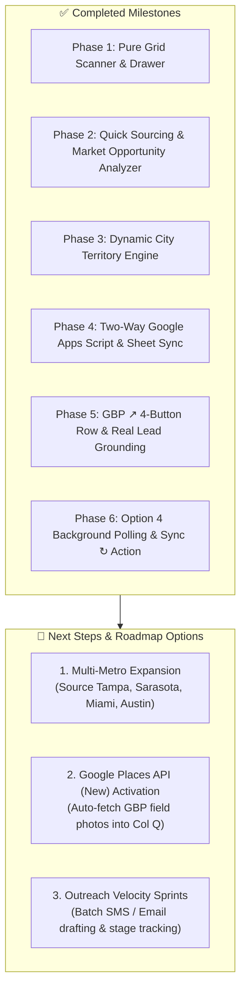

# Lead Command Center — System Checklist & Roadmap

## 📊 Current System State (As of Oct 2, 2026)

* **Master CRM Database**: Cleaned and verified in Google Sheets (`Master_Prospects_CRM`).
* **Active Verified Leads**: **5 Verified Commercial Leads** (Orlando, FL • Plumber).
* **Local Command Center Server**: Active on `http://localhost:3300` (Node.js).
* **Live Remote / Mobile Tunnel**: Active on `https://language-rod-comments-connections.trycloudflare.com`.
* **Google Apps Script Web App**: Version updated, headless sourcing connected to Gemini `gemini-3.1-flash-lite`.
* **CRM Auto-Sync Engine**: Background polling active (60s timer + tab visibility detection + manual `Sync ↻` button).

---

## 📋 Master System Checklist

### 1. Core Data & Google Sheet CRM
- [x] **Universal Credentials**: API keys stored securely in `.env` and GAS Script Properties (never exposed in chat).
- [x] **Model Deprecation Fixed**: Upgraded from retired `gemini-2.0-flash` to fast, stable `gemini-3.1-flash-lite` (zero 503 high-demand errors).
- [x] **Real Data Verification**: Strict commercial-directory prompt enforces 100% real local companies, actual street addresses, real local area code phone numbers, and official websites.
- [x] **Sample / Dummy Data Removed**: Cleaned out legacy prototype rows and synthetic sample leads from master sheet.
- [x] **Master Google Sheet Columns**: Correctly maps 17 columns (A–Q) including slug, name, address, category, keyword, rank, reviews, rating, score, phone, summary, magic link, Maps URL, tier, hook, pipeline status, and photos JSON.

### 2. Synchronization & Interoperability
- [x] **Headless Lead Sourcing (`POST { action: 'SOURCE_LEADS' }`)**: Ingests new leads directly into Google Sheets and appends to dashboard without manual copy-pasting.
- [x] **Bulk Leads Sync (`GET ?action=leads` / `/api/gas/sync`)**: Retrieves full CRM lead array with verified phones, websites, scores, and slugs.
- [x] **Manual Sync Button (`Sync ↻`)**: Integrated into toolbar with instant feedback toast, amber syncing indicator, and reactive re-rendering.
- [x] **Automatic Background Polling (Option 4)**: 60s background timer and `visibilitychange` auto-sync triggers whenever returning to dashboard from Google Sheets.
- [x] **Two-Way Status Updates (`POST { action: 'UPDATE_STATUS' }`)**: Changing pipeline stage in dashboard drawer immediately writes to the exact row in Google Sheets.
- [x] **Two-Way Notes Updates (`POST /api/leads/notes`)**: Operator notes persist to local database and CRM.

### 3. Lead Command Center UI / UX
- [x] **Pure Grid Scanner**: Executive minimalist dark cards with high contrast and zero visual clutter.
- [x] **Dual Metric Scoring**: Real-time GBP Health Score (0–100) and Website Score (0–10 with `Modern`, `Facelift`, `No Website` indicators).
- [x] **Need of Services Rank (1–10)**: Auto-calculated urgency ranking (10 = critical need for turnkey site / GBP turnaround).
- [x] **Dynamic City Territory Engine**: Top dropdown automatically groups leads by verified city (`📍 Orlando, FL (5)`), scoping cards, KPIs, and searches.
- [x] **Single-Line Linear Header (42px)**: Clean integrated navigation across `Pipeline`, `Quick Sourcing`, and `Markets`.
- [x] **Lead Detail Drawer (Row 1 Action Bar)**: 4 responsive square buttons (`[ Site ↗ ] [ Audit ↗ ] [ Tracker ] [ GBP ↗ ]`) formatted for mobile and desktop with zero overlap or text wrapping.
- [x] **Direct Google Business Profile Link**: Multi-source resolution (`mapsUrl`, `gbpUrl`, Google Maps place query) opening in new tab.
- [x] **Phone Integrity**: Phone numbers preserved in drawer header and 1-tap `Call` / `SMS` action buttons.

---

## 🗺️ Completed vs. Upcoming Roadmap

### Detailed Breakdown of Next Roadmap Priorities:

#### 1. Multi-Metro & Cross-Trade Expansion
* **Concept**: Deepen your pipeline across other high-ticket Florida metros and trade categories.
* **Target Hotspots**:
  - `Commercial Roofing` in `Tampa Bay, FL` ($12k avg deal size)
  - `MedSpa & Aesthetics` in `Sarasota, FL` ($1.8k avg LTV)
  - `HVAC Contractor` in `Orlando, FL` ($7.2k avg deal)
* **Goal**: Populate distinct territory dropdown buckets (`📍 Tampa Bay, FL`, `📍 Sarasota, FL`, `📍 Orlando, FL`) for geographic campaign switching.

#### 2. Google Places API (New) Activation & Photo Feeds
* **Concept**: In Google Cloud Console, enable **Places API (New)** on your project.
* **Feature**: Allows `Code.gs` to automatically download and link real GBP storefront and field photos into Column Q, rendering authentic photo carousels inside the lead drawer.

#### 3. Outreach Execution & Conversion Tracking
* **Concept**: Execute outreach on your verified leads using the 1-sentence SMS hook.
* **Feature**: Advance prospects through the 7 Kanban pipeline stages (`Contacted` ➔ `Audit Viewed` ➔ `In Discussion` ➔ `Won`).
