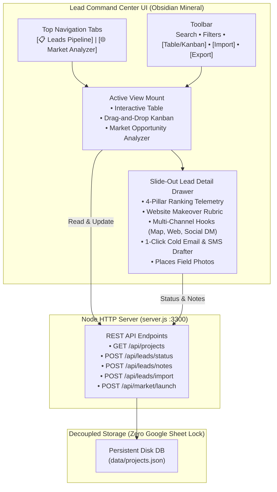

# Lead Command Center — Intelligence & Pipeline Roadmap Update

The **Lead Command Center** has been significantly upgraded with **Phase 2 Intelligence**, an interactive **Drag-and-Drop Kanban Board**, **Autonomous Market Opportunity Analyzer & Sourcing Launcher**, **CSV Data Import/Export Hub**, and a **1-Click Cold Email Drafter**.

All data persists directly to disk in [`data/projects.json`](file:///c:/Users/forth/.gemini/antigravity/scratch/lead-command-center/data/projects.json) and operates decoupled from your live Google Sheets and Google Apps Script workers.

---

## 🚀 Live System Status

* **Live Dashboard URL**: [http://localhost:3300](http://localhost:3300)
* **Local HTTP & REST Server**: Running on `PORT 3300` (Node.js v24.19.0)
* **Persistent Disk Storage**: [`data/projects.json`](file:///c:/Users/forth/.gemini/antigravity/scratch/lead-command-center/data/projects.json)
* **Active Campaigns**:
  * **Active Sourced**: 7 enriched leads
  * **Solar & High-Ticket Roofing (FL)**: 1 lead
  * **MedSpa & Aesthetics Pilot**: Ready for sourcing

---

## 🛠️ What Was Built in this Release

### 1. 📊 Interactive Drag-and-Drop Pipeline Kanban Board
* **7 Visual Pipeline Stages**:
  * `Ready for Outreach` (Ember Alert)
  * `Contacted` (Warm Amber)
  * `Audit Viewed` (Electric Mint)
  * `Blueprint Converted ($19)` (Electric Mint)
  * `Sprint Converted ($199)` (High-Glow Mint)
  * `Web Rebuild Deal ($2.5k+)` (High-Ticket Purple)
  * `Archive / Follow-Up` (Muted Slate)
* **HTML5 Drag-and-Drop**: Drag prospect cards across columns with instant visual feedback (`drag-over` highlights).
* **Instant Disk Persistence**: Every stage change immediately updates [`data/projects.json`](file:///c:/Users/forth/.gemini/antigravity/scratch/lead-command-center/data/projects.json) via `/api/leads/status`.
* **Touch & Keyboard Fallback**: Each card includes a "Move ▾" quick selector for mobile operators.
* **1-Click View Switcher**: Toggle between `📑 Table View` and `📊 Kanban Board` right in the toolbar without losing search or filter state.

### 2. 🌐 Market Opportunity Analyzer & Headless Sourcing Engine (Phase 2)
* **Pre-Flight Market Attractiveness Scoring Matrix**:
  * Evaluate combinations of **High-Ticket Niches** (Roofing, MedSpa, Plumbing, HVAC, Remodeling, Electrical) $\times$ **Target Metros** (Tampa Bay, Orlando, Sarasota, Austin, Miami, Dallas).
  * Real-time metrics: Average Ticket LTV, 3-Pack Deficit Gap (competitors #4–15), Website Rebuild Propensity (% with slow LCP / no sticky CTA), and Franchise Resistance Index.
  * **Market Viability Index (0–100)** with strategic outreach positioning advice.
* **Autonomous Headless Sourcing Launcher**:
  * Select Niche, Location, Target Keyword, and Batch Limit (5 to 20 leads).
  * Sourcing mode: Autonomous AI enrichment or Headless Google Apps Script (`doGet`/`doPost`) webhook endpoint.
  * One-click execution triggers `/api/market/launch`, fetches Google Places & Gemini gap telemetry, populates leads with personalized hooks, and saves to disk.

### 3. 📥 Data Import & 📤 Export Hub
* **1-Click CSV Export**: Downloads the active campaign as a formatted `.csv` including all rankings, review stats, opportunity scores, website rebuild fits, and custom outreach hooks.
* **Smart CSV Ingestion**: Paste raw CSV rows (from Google Sheets, scrapers, or CRM exports) or upload a `.csv` file. Automatically parses columns, infers website grades, and appends non-duplicate leads into persistent storage.

### 4. ✉️ 1-Click Cold Email Drafter & Phone Action Tray
* **Personalized Cold Email Generator** inside the Lead Detail Drawer:
  * Pre-populated subject line: `Quick question about {businessName}'s Google Maps listing`
  * Pre-formatted message body blending the 3-Pack rank gap, mobile website deficit, and the Magic Link audit preview.
  * 1-Click **Copy Email Body** and **Launch in Email Client** (`mailto:`).
* **Click-to-Dial & Click-to-SMS**: Direct `tel:` calling and pre-filled 160-character `sms:` text pitch for mobile outreach.

---

## 🗺️ Architectural Flow

---

## 🎯 Quick Verification Walkthrough

1. Open your browser to **[http://localhost:3300](http://localhost:3300)**.
2. In the toolbar, click **`📊 Kanban`** &rarr; Observe the 7 pipeline columns; drag any card from `Ready for Outreach` to `Contacted` or `Audit Viewed` and verify the status updates in real-time.
3. Click on any business name &rarr; Notice the slide-out drawer with the **1-Click Cold Email Drafter**, **Call/SMS buttons**, and **Website Makeover Rubric**.
4. In the top header, click **`🌐 Market Analyzer`** &rarr; Test switching niches (e.g. *Commercial & High-Ticket Roofing* in *Tampa Bay, FL*), inspect the Market Viability score, and click **`🚀 Launch Sourcing Batch`** to autonomously ingest fresh leads into your database.
5. Click **`📤 Export`** in the toolbar &rarr; Download the enriched pipeline as a `.csv` file.
