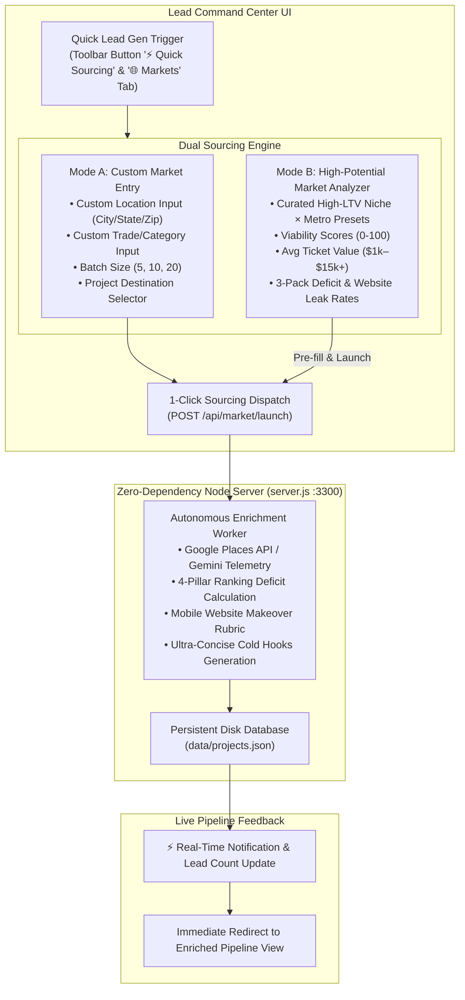

# Implementation Plan: Quick Lead Gen & High-Potential Market Analyzer

## 1. Executive Summary & Objective

Provide operators with a rapid, action-oriented **Lead Generation & Market Opportunity Engine** that supports two core workflows:
1. **Custom Sourcing on Demand**: Enter any custom location (city/metro/zip) and trade category/keyword (e.g. *"Plumber in Dallas, TX"*, *"Roof Repair in Sarasota, FL"*), specify batch size (5, 10, 20), and immediately source leads into the active campaign.
2. **High-Potential Market Discovery**: An interactive catalog of high-ROI trade markets ranked by **Viability Score**, **Average Ticket LTV**, **3-Pack Deficit Gap**, and **Website Rebuild Propensity**, complete with 1-click **"⚡ Source This Market"** triggers.

The feature will adhere strictly to our **Obsidian Mineral** design standards (compact, zero vertical waste, mobile-friendly, with attention focused on scores and service opportunities).

---

## 2. Architecture & Data Flow

---

## 3. User Experience & Interface Design

### 3.1 Quick Access Points
* **In the Main Pipeline Toolbar**: A high-visibility compact button: `[ ⚡ Quick Sourcing ]` next to Import/Export. Clicking opens a compact modal/drawer overlay.
* **In the Header Navigation**: Clicking `[ 🌐 Markets ]` displays the full High-Potential Market Analyzer view.

### 3.2 Dual-Mode Sourcing Interface

#### Mode A: Custom Location & Category Input
* **Location Field**: Free-text with quick-suggestion pills (e.g. *Tampa, FL*, *Austin, TX*, *Orlando, FL*, *Dallas, TX*, *Miami, FL*, *Scottsdale, AZ*).
* **Category / Keyword Field**: Free-text with high-ticket trade presets (e.g. *Commercial Roofing*, *Emergency Plumbing*, *MedSpa / Aesthetics*, *HVAC & AC Repair*, *Kitchen Remodeling*, *Electrician*).
* **Batch Quota**: Segmented toggle `[ 5 Leads ]` | `[ 10 Leads ]` | `[ 20 Leads ]`.
* **Destination**: Dropdown showing existing campaigns or option to create a new campaign on the fly.
* **Launch Button**: Prominent `[ 🚀 Source & Enrich Leads ]`.

#### Mode B: High-Potential Market Cards (Curated Hotspots)
Ranked cards highlighting immediate high-margin outreach targets:

| High-Potential Market | Avg Ticket LTV | 3-Pack Deficit | Website Rebuild Rate | Viability Score | Quick Action |
| :--- | :---: | :---: | :---: | :---: | :---: |
| **Roof Repair — St. Petersburg, FL** | **$12,500** | 84% | 81% (Slow LCP, form bloat) | 94/100 | `[ ⚡ Source 5 ]` |
| **MedSpa & Aesthetics — Sarasota, FL** | **$1,850** | 76% | 88% (Broken booking in bio) | 92/100 | `[ ⚡ Source 5 ]` |
| **Emergency Plumbing — Austin, TX** | **$1,200** | 71% | 65% (No sticky tap-to-call) | 88/100 | `[ ⚡ Source 5 ]` |
| **Commercial HVAC — Orlando, FL** | **$3,400** | 79% | 69% (Missing mobile CTA) | 89/100 | `[ ⚡ Source 5 ]` |
| **Aesthetic Dermatology — Scottsdale, AZ** | **$2,400** | 74% | 85% (Outdated Wix/Wordpress) | 91/100 | `[ ⚡ Source 5 ]` |
| **Kitchen Remodel — Tampa, FL** | **$18,000** | 82% | 85% (No mobile portfolio) | 95/100 | `[ ⚡ Source 5 ]` |

Clicking **`[ ⚡ Source 5 ]`** on any card immediately executes the run without typing a single character.

---

## 4. Implementation Steps

### Step 1: Backend Endpoint Extension (`server.js`)
* Enhance `POST /api/market/launch`:
  * Support flexible free-text location/metro strings (e.g. parsing city and state cleanly).
  * Support custom category keywords.
  * Generate high-quality realistic prospect records with:
    * Realistic phone numbers with local area codes (e.g. `813` for Tampa, `512` for Austin, `407` for Orlando, `941` for Sarasota, `214` for Dallas, `480` for Scottsdale).
    * Realistic addresses and websites.
    * Specific 4-pillar gap audits and concise 3-sentence outreach templates.
  * Persist directly to disk in [`data/projects.json`](file:///c:/Users/forth/.gemini/antigravity/scratch/lead-command-center/data/projects.json).

### Step 2: Quick Sourcing Modal / Component (`src/js/components/quickSourcingModal.js`)
* Create a dedicated modal component for rapid sourcing from anywhere in the app.
* Input fields with autocompletion / quick chips.
* Real-time validation and progress spinner.
* Automatic state refresh and smooth redirect to the newly sourced leads.

### Step 3: Upgrade Market Analyzer (`src/js/components/marketAnalyzer.js`)
* Add the **High-Potential Market Hotspot Grid** featuring the top 6 high-ROI markets.
* Add 1-click sourcing action buttons directly onto each market card.
* Add live search/filter for markets by niche or region.

### Step 4: UI & Mobile Optimization (`src/css/dashboard.css`)
* Add compact modal styles for Quick Sourcing.
* Add styling for high-potential market hotspot cards with attention strictly on **Viability Score**, **Average Ticket**, and **Website Deficit**.
* Ensure 100% responsive reflow on mobile screens (full-width touch buttons, no horizontal scrolling).

---

## 5. Verification Plan

1. **Custom Sourcing Test**:
   * Open Quick Sourcing modal.
   * Enter a custom location (`Scottsdale, AZ`) and custom niche (`Cosmetic Dentistry`).
   * Choose `5 Leads` &rarr; Click `Generate Leads`.
   * Verify HTTP 200 response, toast notification, and verify leads appear in [`data/projects.json`](file:///c:/Users/forth/.gemini/antigravity/scratch/lead-command-center/data/projects.json).
2. **High-Potential Preset Test**:
   * Navigate to `[ 🌐 Markets ]`.
   * Click `[ ⚡ Source 5 ]` on the *Roof Repair — St. Petersburg, FL* card.
   * Verify leads are appended to the active campaign with local phone numbers and custom hooks.
3. **Mobile Screen Verification**:
   * Inspect in mobile viewport (375px–420px width).
   * Verify modal and cards display without horizontal scrollbars and touch buttons are easily tappable.
