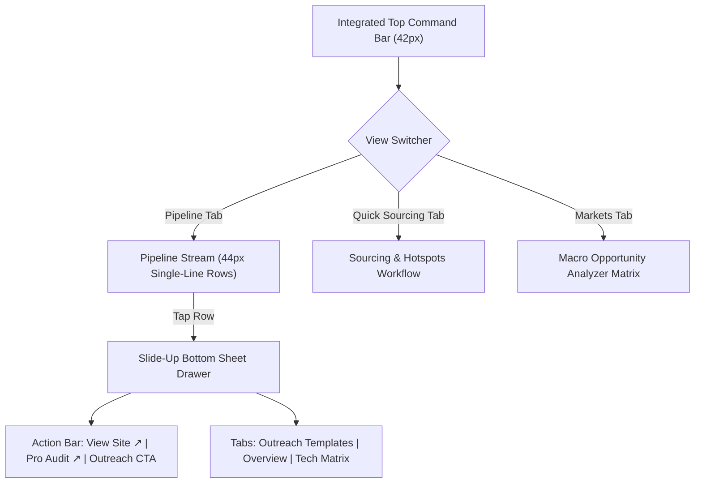

# Lead Command Center Refactor Plan
## Linear / Raycast Style Minimalist Overhaul

### Executive Summary & Design Pivot
This plan restructures the Lead Command Center from the high-contrast neon "Obsidian Telemetry" design into a **Refined Executive Dark** system inspired by **Linear** and **Raycast**. It completely removes decorative clutter and harsh glows, optimizes the header into a single-line command bar (~42px), converts leads into ultra-dense 44px single-line issue rows, moves Quick Sourcing into its own dedicated top tab, and refines the mobile slide-up sheet with direct links and de-bloated outreach copy.

---

### Key Architectural Decisions (Aligned via Grill-Me)

| Area | Previous State | New Refactored State |
| :--- | :--- | :--- |
| **Color Scheme** | High-contrast electric mint & neon coral with heavy drop-shadow glows | **Refined Executive Dark (Linear/Raycast)**: Smoky slate (`#0D0E11`, `#16181D`), subtle border keylines (`#262830`), soft pastel indicators (soft rose `#F87171`, soft violet `#A78BFA`, soft emerald `#34D399`, amber `#FBBF24`), zero harsh glows. |
| **Header Ergonomics** | Stacked header bars (~120px+ total) with brand badges, tabs, and status pills | **Integrated Command Bar**: A single horizontal row (~42px tall) uniting workspace selector, 3 view tabs (`Pipeline`, `Quick Sourcing`, `Markets`), inline search, and count pill. Zero vertical waste. |
| **Lead Items** | Chunky multi-row cards taking ~140px vertical space each | **Single-Line Linear Issue Rows (~44px tall)**: Left: `#Rank` + `Company Name`; Middle: subtle city/trade; Right: `Score` + `Needs Website` soft badge. Only scores and website need pull visual focus. |
| **Quick Lead Gen** | Large banner & accordion pushed directly above the pipeline | **Dedicated Sourcing Tab**: Moved into the top navigation switcher alongside `Pipeline` and `Markets` as its own full-screen workflow, leaving 100% of pipeline space for scanning leads. |
| **Detail Drawer** | Generic drawer with mixed priorities | **Slide-Up Bottom Sheet with Pinned Quick-Action Bar**: Header displays direct Site link, Audit link, and high-visibility `[ ✉️ Outreach ]` CTA; sub-tabs for `✉️ Outreach Templates`, `📋 Overview`, and `🔍 Tech Matrix`. |
| **Outreach Copy** | Long diagnostic summaries | **Strict Zero-Jargon Copy**: Precise 3-sentence cold email and 1-sentence SMS hook with 1-click copy buttons and toast feedback. |

---

## Proposed Changes by Component



---

### Step 1: Design Tokens & Base Theme Refactor (`src/css/tokens.css`)
- Remove all aggressive neon glows (`--mg-brand-glow`, `.glow-mint`, `.glow-coral`).
- Introduce Linear-style smoky background palette:
  - `--mg-canvas: #0D0E11` (Deep dark slate bedrock)
  - `--mg-surface-card: #15171C` (Container surface)
  - `--mg-surface-subtle: #1C1F26` (Subtle wells / input backgrounds)
  - `--mg-surface-hover: #222630` (Interactive row hover)
  - `--mg-border-subtle: rgba(255, 255, 255, 0.08)` (Crisp micro keylines)
  - `--mg-border-strong: rgba(255, 255, 255, 0.16)`
- Soft pastel functional colors:
  - `--mg-accent-primary: #5E6AD2` (Linear indigo / soft purple for primary UI actions)
  - `--mg-status-rose: #F87171` (Soft terracotta rose for No Website / Critical Gap)
  - `--mg-status-amber: #FBBF24` (Soft amber for Score alerts)
  - `--mg-status-violet: #A78BFA` (Soft violet for Rebuild Fit)
  - `--mg-status-emerald: #34D399` (Soft emerald for Good Site / Converted)
  - `--mg-text-primary: #F0F1F3` (Crisp text)
  - `--mg-text-secondary: #8A8F98` (Muted labels)
  - `--mg-text-muted: #5C6068` (Secondary metadata)

### Step 2: Integrated Command Bar & Layout (`index.html` & `src/css/dashboard.css`)
- Replace the multi-stacked header with a single 42px top bar:
  - Left: Minimal brand mark + Workspace dropdown
  - Center/Right: Linear tab pills `[ 📋 Pipeline (12) ]`, `[ ⚡ Quick Sourcing ]`, `[ 🌐 Markets ]`
- Remove the bottom mobile bar to prevent double-navigation and maximize thumb scroll area on mobile.
- Set main content padding to a crisp `0.5rem 0.75rem` for edge-to-edge density.

### Step 3: Pipeline View & Single-Line Issue Rows (`src/js/components/leadTable.js`)
- Compact Toolbar:
  - Search input with inline quick filters (`All`, `Score ≥60`, `Needs Website`, `Uncontacted`).
  - View switchers (`List Rows`, `Detailed Grid`, `Kanban`).
- Single-Line Row Markup:
  - Height locked at `44px` with smooth flex alignment:
    - Rank badge `#15` + Company Name (bold `#F0F1F3`, truncated if long).
    - Middle: muted `📍 Orlando • HVAC • 4.2★` (hidden on narrow screens to prevent wrap).
    - Right: Soft score badge (`89`) in amber/mint + Soft pill (`🚨 No Site` or `🔥 Rebuild Fit`).
  - Entire row is tappable, expanding the bottom sheet drawer.

### Step 4: Dedicated Quick Sourcing View (`src/js/components/quickSourcing.js`)
- Create a dedicated component for `⚡ Quick Sourcing` that renders when the user clicks the Sourcing tab:
  - Clean card with Target Location input + Trade Category select + Batch quantum (`5`, `10`, `20`) + Master `[ 🚀 Source Leads ]` CTA.
  - 3 High-Velocity Market Hotspots (St. Pete Roofing, Sarasota MedSpa, Orlando HVAC) with 1-click `[ ⚡ 5 ]` triggers.
  - Automatically loads sourced leads into the database and redirects to the Pipeline tab with a toast notification.

### Step 5: Mobile Slide-Up Lead Sheet & Finalized Outreach Copy (`src/js/components/leadDrawer.js`)
- Refactor drawer into a Linear-style clean bottom sheet (or right panel on desktop):
  - Grab handle bar for smooth touch UX.
  - Top header: Company Name + Phone + `#Rank`.
  - Pinned Quick-Action Bar:
    - `[ 🌐 Current Site ↗ ]` (or disabled `🚫 No Site`)
    - `[ 📊 Pro Audit ↗ ]` (opens live client audit)
    - `[ ✉️ Outreach ]` (accent button that jumps directly to outreach templates)
  - Tab strip: `✉️ Outreach Templates`, `📋 Overview & Status`, `🔍 Tech Matrix`.
  - **Finalized Ultra-Minimal Outreach Copy (Aligned via Grill-Me)**:
    - **Email Subject**: `Question for ${lead.businessName}`
    - **Email Body**:
      ```text
      Hello, I'm in your area. Let me know if you need help with this: ${lead.magicLink || auditUrl}

      [Your Name]
      ```
    - **SMS / Text Pitch**:
      ```text
      Hey, I'm in your area. Let me know if you need help with this: ${lead.magicLink || auditUrl}
      ```
    - **Social DM**:
      ```text
      Hey, I'm in your area. Let me know if you need help with this: ${lead.magicLink || auditUrl}
      ```
    - 1-click `[ Copy Body ]` and `[ Copy SMS ]` buttons with instant toast feedback.

---

## Verification Plan

### 1. Visual Verification
- Verify that background is smoky slate (`#0D0E11`), with no harsh glows, harsh green/coral flashes, or visual fatigue.
- Verify that the header is a single 42px command bar with zero vertical waste.
- Verify that lead cards render as clean, 44px single-line issue rows on desktop and mobile.

### 2. Functional Verification
- Test clicking each lead row to ensure the slide-up drawer opens instantly with site link, audit link, and outreach templates.
- Test 1-click copy buttons for email and SMS copy.
- Test switching to the `⚡ Quick Sourcing` tab, executing a batch source (e.g. 5 leads for Tampa Roofing), and ensuring leads appear in the Pipeline tab and persist to `data/projects.json`.
- Test search filtering and quick filter chips (`Score ≥60`, `Needs Website`, `Uncontacted`).
