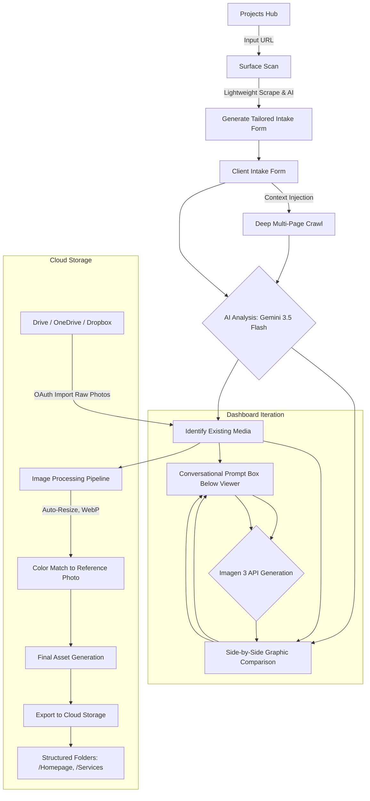

# Website Photo & Infographic Auto-Planner: Master Plan

## 1. Executive Summary
A web-based SaaS platform designed for business owners, photographers, and web developers to automate the planning, generation, and processing of website media. By simply inputting a website URL, the system deep-crawls the site, analyzes existing media against business offerings, and generates a structured "Master Plan" for new photo requirements and infographic updates. 

## 2. Architecture & Tech Stack
* **Platform Type:** Web-based SaaS Application.
* **Frontend:** Next.js / React (Ideal for complex, interactive side-by-side dashboards and cloud OAuth flows).
* **Backend:** Node.js or Python (FastAPI/Django) to handle heavy asynchronous image processing and AI API orchestration.
* **AI Engine:** Google Cloud Vision & Gemini Pro Vision for media analysis/tagging; Imagen 3 (or specific Google generation APIs) for creating updated infographics.

## 3. Workflow & Features

### Phase 1: Ingestion & Deep Analysis
1. **URL Prompt:** The user inputs their existing website URL.
2. **Deep Crawl:** The system performs a multi-page crawl (Homepage, Services, About, Contact) to extract text, site structure, and all current visual assets.
3. **AI Mapping:** Gemini Pro Vision analyzes the current photos, identifies outdated or generic graphics, and cross-references them with the extracted list of services/offerings.
4. **The Master Plan Generation:** The system outputs a comprehensive list of *needed* photos (e.g., "Missing a high-quality team photo on the About page," "Service X needs a visual representation").

### Phase 2: The Multi-Tab Dashboard (Frontend UI Redesign)
To avoid a cluttered, monolithic dashboard, the frontend capabilities are separated into dedicated pages accessible via a minimized sidebar menu:

1. **Projects Hub & Surface Scan (`/projects`)**
   * *Purpose:* The operator's main landing page and project initiator.
   * *Capabilities:* When clicking "New Project", the operator inputs the client's URL. The backend immediately performs a **"Surface Scan"** (a very fast, lightweight scrape of just the homepage/services). Gemini analyzes this to identify the business type and core offerings, generating a dynamic, highly-tailored intake form schema. 

2. **Client Intake Form (`/intake/[projectId]`)**
   * *Purpose:* Public-facing, shareable questionnaire for the end-client.
   * *Capabilities:* Rather than a blank, overwhelming form, the client sees a customized questionnaire generated by the Surface Scan. Key features include:
     * **Dynamic Questions:** Instead of "What services do you offer?", it asks tailored questions like "Which of these 3 detected services needs new photography?"
     * **Discovered Pages Checklist:** The AI extracts the site's internal links and presents a clean checklist (e.g., "We found 12 pages. Select the ones you want to focus on for this reshoot"). Features a "Select All / Deselect" toggle to instantly eliminate guesswork.
     * **Submit & Sync:** Once submitted, the project status updates to "Ready for Analysis" on the operator's dashboard.

3. **Site Audit & Generation (`/audit`)**
   * *Purpose:* The core analytical engine.
   * *Capabilities:* Scrapes the site and combines it with the Intake Form data. Identifies missing metadata, outdated/generic images, and poorly formatted media. Houses the AI Chat interface to generate brand-new graphics.
   
4. **Photo Studio & Color Correction (`/studio`)**
   * *Purpose:* The processing pipeline for new assets.
   * *Capabilities:* Analyzes raw uploaded photos and applies automated color correction, reference image filter matching, and responsive WebP formatting.

5. **Proposal & Export (`/proposal`)**
   * *Purpose:* The dual-purpose deliverable generator.
   * *Capabilities:* Aggregates findings from the Audit and Studio tabs into a dynamic PDF. This PDF serves two distinct purposes:
     1. **Client Sales Proposal:** Features pricing estimates, before/after examples, and executive summaries to close the deal.
     2. **On-Scene Production Roadmap:** Acts as a physical staging guide for the photographer. It generates a structured "Shot List" grouped by page/location with physical checkboxes, staging notes, and staff requirements so the photographer can clip it to a clipboard and execute perfectly on the day of the shoot.

6. **Settings (`/settings`)**
   * *Purpose:* User customization.
   * *Capabilities:* Manage cloud integrations, set default API keys, and define global brand styles.

## 4. System Flow Diagram

---

## 5. Current Checkpoint (MVP Milestone 1)
* **Status:** Core infrastructure is online. The dual-server setup (`FastAPI` & `Next.js`) runs stably via `dev.ps1` with zero port collisions and background graceful shutdowns.
* **Integrations:** 
  * Google Cloud Storage exporter lazily loads ADC credentials successfully.
  * AI Analyzer is wired to `gemini-3.5-flash-lite` for lightning-fast structured JSON generation that bypasses 503 capacity outages.
  * Next.js frontend strictly maps incoming JSON payloads to the `ProposalEditor` UI, eliminating render crashes.
* **Next Action Items (The "Extensive Review" Phase):**
  1. **UX/UI Overhaul:** Deep dive into the side-by-side viewer and the proposal components to ensure they align perfectly with the client presentation use-case.
  2. **Schema Enhancements:** We need to update the Pydantic backend models and frontend mappings to include missing rich data (e.g., precise hour estimations, tag categorization, brand alignment boolean logic).
  3. **PDF Generation Refinement:** Lock in the printer-friendly rendering inside `ProposalDocument.tsx`.
