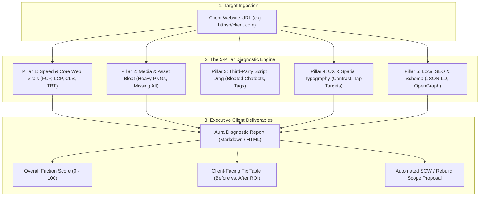

# Autonomous Website Diagnostic & Performance Analysis Engine
**Studio Venture / Internal Pipeline**: *Aura Diagnostic Engine (ADE)*  
**Stack**: Google PageSpeed Insights API $\rightarrow$ Headless Chrome Telemetry $\rightarrow$ Antigravity Executive Reporter

---

## Executive Overview

The **Aura Diagnostic Engine (ADE)** is an automated technical audit pipeline that scans any public website URL, detects speed, usability, asset, and SEO bottlenecks, and generates a client-facing **"Executive Bottleneck & Remediation Matrix" (Fix Table)**.

It serves three vital business functions for Eye Of Ru Enterprises:
1. **The Ultimate Lead Magnet & Pitch Instrument**: Arm our sales conversations with irrefutable, objective proof of why their current site is failing and costing them money.
2. **Rebuild Intake Benchmarking**: Automatically establish the "Before" baseline to prove radical ROI after launching on our Cloudflare Pages edge stack.
3. **Pre-Launch Production QA**: Verify that our new builds hit 95+ performance, zero missing meta tags, and sub-second load times.



---

## 1. The 5-Pillar Friction Framework

The engine evaluates websites across 5 distinct operational pillars:

### Pillar 1: Speed & Core Web Vitals (Desktop vs. Mobile)
* **Mobile vs. Desktop Load Times**: Captures real-world Largest Contentful Paint (LCP), First Contentful Paint (FCP), and Total Blocking Time (TBT).
* **The "Bounce Cost" Calculator**:
  * *Formula*: For every second beyond 2.5s, compute the estimated visitor abandonment rate (e.g., *"At 7.8 seconds on mobile, Google telemetry estimates 53% of paid/organic visitors leave before seeing your offer"*).

### Pillar 2: Asset & Media Bloat
* **Uncompressed Images**: Flags oversized JPEG/PNG files (> 300KB) that lack modern WebP/AVIF compression.
* **Missing Alt Attributes**: Identifies every image lacking `alt` text (harming accessibility compliance and Google Image ranking).
* **Missing Responsive Dimensions**: Flags images without explicit `width`/`height` attributes that cause Cumulative Layout Shift (CLS).

### Pillar 3: Third-Party Script & Plugin Drag
* **Chatbot & Widget Penalty**: Analyzes how third-party live chat widgets (e.g. bloated Intercom, Tidio, Zendesk, or unoptimized WordPress plugins) block the main thread and delay interactivity by 2–4 seconds.
* **Tag Manager Overload**: Flags duplicate Google Tag Manager tags, Meta pixels, and un-deferred scripts.
* **Render-Blocking Web Fonts**: Detects un-optimized Google Fonts or `@font-face` declarations stalling page rendering.

### Pillar 4: UX, Spatial Typography & Mobile Usability
* **Color Contrast Failures**: Scans text against background colors to identify WCAG AA contrast failures (< 4.5:1 ratio) that cause eye strain.
* **Typography Readability**: Flags body copy smaller than 14px on mobile or cramped line heights (< 1.4).
* **Tap Target Cramping**: Identifies buttons or links smaller than 48x48px or spaced closer than 8px, causing accidental taps on smartphones.

### Pillar 5: Local SEO & Structured Schema Architecture
* **Schema Absence**: Checks for missing `schema.org/LocalBusiness` or `Organization` JSON-LD markup.
* **OpenGraph Gaps**: Checks for missing or broken `og:image` (1200x630px), `og:title`, and `og:description` that cause ugly broken links when shared on social media or SMS.
* **Meta Description & Title Gaps**: Flags missing, duplicated, or truncated titles (> 60 chars) and meta descriptions (> 160 chars).

---

## 2. The Client-Facing Deliverable: The "Bottleneck & Remediation Matrix" (Fix Table)

When presented to a prospective or existing client, the technical telemetry is translated into an **Executive Fix Table**:

| Category / Issue | What We Discovered | Business & Revenue Impact | The Eye Of Ru Modern Fix | Priority |
| :--- | :--- | :--- | :--- | :---: |
| **Mobile Speed** | Mobile load time is **8.2s** (LCP: 6.4s). Desktop load time is **4.8s**. | **High Bounce Rate**: Over 50% of mobile users abandon the site before interacting. | Migrate to Cloudflare Pages edge stack with sub-second global delivery. | [CRITICAL] |
| **Third-Party Script Drag** | Client chatbot & legacy tracking scripts consume **3.4s** of main-thread execution time. | Interactivity is locked; visitors tap buttons that do not respond. | Replace heavy third-party widget with lightweight, serverless AI Concierge. | [CRITICAL] |
| **Media Bloat** | 14 images are uncompressed PNGs (> 1.2MB each); 8 images missing `alt` tags. | Sluggish load times; accessibility compliance violation; penalized on Google. | Automated conversion to WebP/AVIF, responsive `srcset`, and descriptive alt tagging. | [HIGH] |
| **Local SEO & Schema** | Zero `LocalBusiness` JSON-LD structured data detected. | Google cannot parse verified NAP, business hours, or review ratings for Local Pack. | Inject rich `LocalBusiness` schema with Google Place ID and CID map backlinks. | [HIGH] |
| **UX & Typography** | Body copy is 12px; grey text on white background (contrast ratio: 2.8:1). | Harsh eye fatigue; poor readability for older demographics and mobile users. | Modern luxury typography tokens, high-contrast dark/light dual palettes. | [MEDIUM] |
| **Social Sharing** | Missing `og:image` card; sharing link on iMessage/LinkedIn shows blank grey box. | Low click-through rates on shared proposals, referrals, and social posts. | 1200x630px branded social share card generated via Nano Banana brand engine. | [MEDIUM] |

---

## 3. Operational Autonomous Skill: `site-audit-engine`

The diagnostic tool is codified in **`.agents/skills/site-audit-engine/`** containing:

1. **`Invoke-SiteAudit.ps1` (PowerShell Script)**:
   * **Telemetry Source A**: Google PageSpeed Insights (PSI) API (v5) querying both mobile and desktop strategies using our `GOOGLE_MAPS_API_KEY` or public endpoint.
   * **Telemetry Source B**: Headless Chrome / DOM inspector querying image sizes, missing `alt` tags, schema scripts, and viewport meta tags.
2. **Automated Headless Chrome PDF Compilation**:
   * Uses `assets/templates/audit-report-template.html` to compile a branded 3-page executive brief to `<project>/artifacts/audits/`.
3. **Automated Google Drive Ingestion**:
   * Posts base64 PDF payload to the master Google Apps Script webhook, storing files in `Eye Of Ru Enterprises / Clients / [Client Name] / 01_Audits & Proposals/`.
4. **Integration with `site-intake-harvester`**:
   * When running intake for a site rebuild (`Mode B: Scrape`), automatically run `site-audit-engine` first to save the baseline "Before" benchmark before touching any code.
5. **Strict Zero-Emoji & Unprompted Icon Mandate**:
   * All reports, tables, email alerts, and UI badges generated by ADE must use clean, professional ASCII typography (e.g. `[CRITICAL]`, `[HIGH]`, `[MEDIUM]`).
   * Never inject informal emojis, emoji status flags, or unrequested icons into client reports or UI components.

---

## 4. Execution Command

```powershell
powershell -ExecutionPolicy Bypass -File ".agents\skills\site-audit-engine\scripts\Invoke-SiteAudit.ps1" `
  -TargetUrl "https://example.com" `
  -ClientName "Example Corp" `
```

