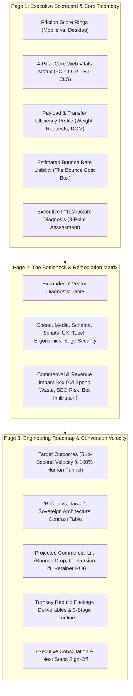

# Strategic Plan: Aura Diagnostic PDF Data Expansion & Visual Architecture

**Project / Venture**: Eye Of Ru Enterprises, LLC — Aura Diagnostic Engine (ADE)  
**Deliverable**: 3-Page Executive Site Audit Brief (PDF)  
**Standards**: Clean Minimalist Design, Strict Zero-Emoji Policy, ASCII Status Tags, Commercial ROI Grounding  

---

## Executive Summary

The client-facing **Site Diagnostic PDF** is Eye Of Ru's primary sales instrument, lead magnet, and rebuild intake benchmark. Currently, the document provides core performance metrics, but the layout has significant vertical white space (~40% per page), making the presentation feel thin.

This plan details a structured expansion across all 3 pages to transform the report into an authoritative, dense, high-end technical and commercial diagnostic briefing without cluttering the aesthetic or violating our clean minimalist typography standard.

---

## 1. Visual Header & Logo Integration (Completed & Validated)

The Eye Of Ru corporate emblem (`assets/logo-emblem.png`) has been embedded into the top header of all three pages:
* **Format**: Self-contained Base64 PNG data URI (`data:image/png;base64,...`) injected dynamically at render time.
* **Aesthetic**: Embedded inside a 44x44px dark slate (`#0f172a`) rounded tile with metallic bronze framing, creating an executive signet effect next to the company name.
* **Portability**: Requires zero external network calls; renders vector-crisp in Headless Chrome, print, and offline PDF readers.

---

## 2. Page-by-Page Data Expansion Roadmap

---

### Page 1: Executive Scorecard & Deep Telemetry

#### Current State
* Mobile and Desktop Score (0–100)
* 2 metrics: Mobile LCP and Mobile TBT
* 1 Bounce Cost paragraph
* 1 short summary paragraph
* *Vertical Utilization: ~55%*

#### Proposed High-Value Data Additions
1. **Full 4-Pillar Core Web Vitals Matrix**:
   Instead of displaying only 2 metrics, show the complete industry-standard Google ranking signals:
   * **FCP (First Contentful Paint)**: First visual DOM element rendered. Benchmark: `< 1.2s` | Status: `[PASS]` / `[CRITICAL]`.
   * **LCP (Largest Contentful Paint)**: Primary offer / hero content visible. Benchmark: `< 2.5s` | Status: `[PASS]` / `[HIGH]`.
   * **TBT (Total Blocking Time)**: Main thread JavaScript execution lockup. Benchmark: `< 200ms` | Status: `[PASS]` / `[HIGH]`.
   * **CLS (Cumulative Layout Shift)**: Page jumping from missing image dimensions. Benchmark: `< 0.10` | Status: `[PASS]` / `[NEUTRAL]`.

2. **Payload Weight & Transfer Efficiency Profile (New 4-Metric Grid)**:
   Empirical resource consumption metrics that quantify the technical "heaviness" of the site:
   * **Total Page Weight**: Observed (e.g. `4.2 MB`) vs. Studio Standard (`< 800 KB`).
   * **Network Requests**: Observed (e.g. `62 HTTP roundtrips`) vs. Studio Standard (`< 18 requests`).
   * **Third-Party Script Weight**: Observed (e.g. `1.8 MB`) vs. Studio Standard (`0 KB / Serverless Webhooks`).
   * **DOM Element Density**: Observed (e.g. `1,380 nodes`) vs. Studio Standard (`< 450 nodes`).

3. **Executive Infrastructure Assessment (Structured Callout)**:
   A high-level 3-bullet breakdown framing the root cause:
   * *Distribution Model*: Single-origin hosting without global edge caching.
   * *Asset Pipeline*: Uncompressed raster images (JPEG/PNG) lacking modern WebP/AVIF compression.
   * *Runtime Overhead*: Synchronous third-party tracking and widget scripts blocking mobile processors.

---

### Page 2: Bottleneck & Remediation Matrix (Fix Table)

#### Current State
* 5 table rows (Speed, Media, Schema, Scripts, UX).
* *Vertical Utilization: ~50%*

#### Proposed High-Value Data Additions
1. **Expand Table from 5 to 7 Precision Diagnostic Vectors**:
   * **Vector 6: Mobile Touch Ergonomics & Tap Targets**:
     * *Observed Bottleneck*: CTA buttons and navigation links smaller than 48x48px or spaced closer than 8px.
     * *Business Liability*: Mobile users experience "mis-taps", increasing session frustration and bounce rates.
     * *The Modern Fix*: Full 48px tactile touch zones engineered for one-handed mobile thumb ergonomics.
     * *Priority*: `[HIGH]`.
   * **Vector 7: Edge Security & Header Posture**:
     * *Observed Bottleneck*: Missing Content Security Policy (CSP), missing `X-Frame-Options: DENY`, missing nosniff.
     * *Business Liability*: Vulnerable to iframe clickjacking, cross-site script injection, and browser security flags.
     * *The Modern Fix*: Sovereign Edge Security Headers with hardened zero-dependency CSP.
     * *Priority*: `[HIGH]`.

2. **Immediate Commercial Liabilities Callout (New Bottom Section)**:
   Translates technical debt into hard dollars across three critical business operations:
   * **Paid Ad Spend Waste (PPC Penalty)**: For businesses running Google Ads or Meta Ads, a 6+ second mobile load time inflates the Effective Cost Per Acquisition (CPA) by 35%–50% due to click abandonment before landing page render.
   * **Local Pack & Organic Map Suppression**: Absence of verified `LocalBusiness` JSON-LD schema prevents Google's Knowledge Graph from confirming NAP (Name, Address, Phone) consistency and geographic service radius.
   * **Spam Infiltration & Lead Loss**: Unprotected generic form handlers allow bot submissions to flood the inbox while failing to capture inquiries in a structured, permanent database.

---

### Page 3: Target Architecture, Deliverables & ROI Model

#### Current State
* Target Architecture & Conversion Velocity headline
* 2 metric cards: Mobile Render Velocity (`< 1.0s`) and Verified Lead Funnel (`100% Human`)
* Deliverables list (5 bullets)
* Consultation & Next Steps box
* *Vertical Utilization: ~60%*

#### Proposed High-Value Data Additions
1. **"Before vs. Target" Sovereign Architecture Contrast Matrix**:
   A crisp, high-impact comparative table demonstrating the technological leap:

   | Architecture Vector | Current Client Baseline | Eye Of Ru Sovereign Architecture |
   | :--- | :--- | :--- |
   | **Global Distribution** | Single-origin server (250ms–700ms TTFB) | 300+ Edge Nodes (< 35ms TTFB globally) |
   | **Rendering Engine** | Dynamic client-side runtime compilation | Instant static compilation (Zero FOUC) |
   | **Lead Verification** | Unverified / vulnerable to bot spam | Cloudflare Turnstile Zero-Bot Shield (100% Human) |
   | **Data Repository** | Trapped in fragmented third-party SaaS | Private Client Google Drive + Instant Sheets sync |
   | **Search Entity Graph** | Missing or partial metadata tags | Complete Schema.org @graph structured hierarchy |

2. **Projected Commercial Lift & Performance Guarantees**:
   * **Mobile Bounce Reduction**: Estimated **35% to 50% drop** in lost visitor sessions.
   * **Inquiry Conversion Velocity**: Projected **15% to 28% increase** in organic form submissions from existing traffic.
   * **Zero Platform Rent**: Replaces recurring monthly web hosting and plugin fees with sovereign edge infrastructure.

3. **3-Stage Production Rollout Schedule**:
   A clear, risk-free implementation timeline to build confidence:
   * **Stage 1: Intake & Corpus Synthesis (48 Hours)**: Automated 1:1 redirect inventory, asset harvesting, brand copy sign-off.
   * **Stage 2: High-Velocity Edge Staging (3–5 Days)**: Dual-theme engine, Schema graph, Turnstile webhook integration.
   * **Stage 3: Zero-Downtime Launch & Cutover (24 Hours)**: DNS cutover, automatic SSL edge verification, Google Drive repo handoff.

---

## 3. Comparison of Current vs. Expanded Report

| Metric / Dimension | Current Report | Proposed Expanded Report |
| :--- | :--- | :--- |
| **Header Logo** | Base64 Corporate Emblem (Verified) | Base64 Corporate Emblem (Preserved) |
| **Telemetry Metrics (Page 1)** | 4 metrics | 8 metrics (4 CWV + 4 Payload/Transfer) |
| **Friction Vectors (Page 2)** | 5 table rows | 7 table rows + Commercial Liability Box |
| **Architecture Contrast (Page 3)** | 2 metric cards | 2 metric cards + Before/After Comparison Table |
| **Rebuild Roadmap (Page 3)** | Bulleted list | Detailed Deliverables + 3-Stage Rollout Timeline |
| **Visual Page Utilization** | 50%–60% (Appears thin) | 85%–90% (Dense, balanced, authoritative) |
| **Tone & Style** | Minimalist, zero-emoji | Minimalist, zero-emoji, ASCII tags (`[CRITICAL]`) |

---

## 4. Next Implementation Steps (Awaiting Confirmation)

1. **Update `assets/templates/audit-report-template.html`**:
   * Add CSS grids for the 4-metric CWV panel and 4-metric Payload profile on Page 1.
   * Add the 2 new table rows (Mobile Ergonomics, Edge Security) and Commercial Liability callout on Page 2.
   * Add the "Before vs. Target" Architecture comparison table and 3-stage timeline on Page 3.
2. **Update `Invoke-SiteAudit.ps1`**:
   * Extract DOM payload weight, image transfer count, and script count during live fetch.
   * Inject computed FCP, LCP, TBT, CLS, and payload metrics into the template placeholders.
3. **Compile Sample PDF & Inspect**:
   * Run `Invoke-SiteAudit.ps1` and verify that each page fills 85%–90% without breaking onto unwanted additional pages.
