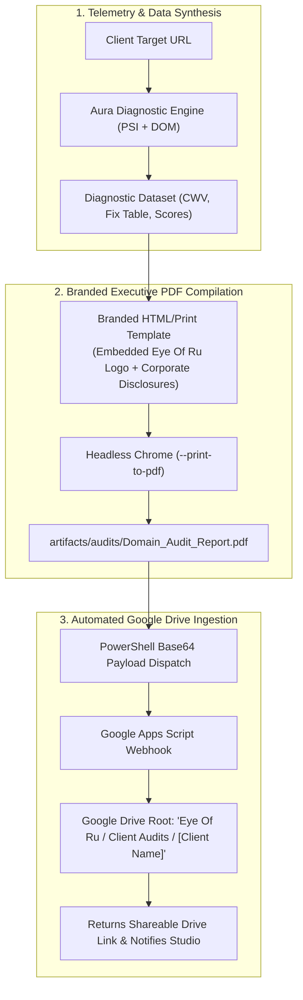
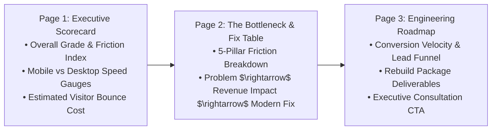

# Executive Diagnostic PDF & Google Drive Ingestion Blueprint
**Stack**: Headless Chrome `--print-to-pdf` $\rightarrow$ Eye Of Ru Branded Template $\rightarrow$ Google Apps Script $\rightarrow$ Google Drive

---

## Executive Workflow Architecture



---

## 1. Branded Executive PDF Specification

The PDF report is engineered using a clean, print-optimized HTML5/CSS architecture rendered directly to PDF via **Headless Chrome**. This avoids heavy third-party dependencies while guaranteeing vector-crisp typography, perfect margins, and high-end visual fidelity.

### A. Design & Layout Hierarchy
* **Dimensions & Margins**: Standard US Letter (`8.5in x 11in`), `@page { margin: 0.6in; }`.
* **Palette & Brand Elements**:
  * **Header**: Deep slate accent bar with embedded **Eye Of Ru Cyber-Sovereignty Emblem** (`assets/logo.jpg`), business name, incorporation details, and audit generation timestamp.
  * **Accents**: Eye Of Ru metallic bronze (`#c89b4e`) for badges, section borders, and score callouts.
  * **Print Readability**: High-contrast dark charcoal text on crisp white surfaces for optimal printing and email readability.
* **Corporate Governance Block (Footer)**:
  * *"Prepared by Eye Of Ru Enterprises, LLC • Digital Venture Studio & Software Lab • State of Florida, USA"*
  * Client URL, date, confidentiality statement, and direct inquiry link (`contact@eyeofruenterprisesllc.com`).
* **Zero Emojis & Unprompted Icons (STRICT)**:
  * All PDF headers, score cards, and table cells must strictly use clean enterprise typography and ASCII bracket tags (e.g. `[CRITICAL]`, `[HIGH]`).
  * Never render emojis or informal icon graphics in the generated PDF documents.

### B. Report Structure (3-Page Executive Briefing)



1. **Page 1: Executive Scorecard & Speed Telemetry**:
   * Health Score Ring (0–100) and Grade (A through F).
   * Mobile vs. Desktop Load Time comparison (FCP, LCP, TBT, CLS).
   * **The "Bounce Cost" Box**: Calculated revenue/traffic penalty (e.g. *"At 8.2s mobile load time, Google estimates 53% of mobile traffic bounces before seeing your offer"*).
2. **Page 2: The Bottleneck & Remediation Matrix (Fix Table)**:
   * The 5-pillar friction breakdown formatted as a high-impact, side-by-side diagnostic table:
     * Speed / Core Web Vitals
     * Asset & Media Bloat (uncompressed PNGs, missing `alt` tags)
     * Third-Party Script Drag (bloated chatbots, un-deferred tracking pixels)
     * UX & Spatial Typography (contrast ratios, mobile tap targets)
     * Local SEO & Schema (missing `LocalBusiness` JSON-LD, missing OpenGraph cards)
3. **Page 3: Engineering Roadmap & Conversion Velocity**:
   * Expected outcomes and commercial performance guarantees:
     * **Mobile Render Velocity**: Sub-second (< 1.0s) instantaneous first contentful paint, eliminating mobile visitor bounce.
     * **Verified Lead Funnel**: 100% human verified inquiries with automated zero-friction bot filtering and real-time alert routing.
     * **Production Deliverables**: Sovereign dual-token architecture, strict 1:1 301 redirect mapping, full Schema.org LocalBusiness graph integration, and automated Google Drive client scaffolding.
   * Studio contact details and executive consultation CTA.

---

## 2. Headless PDF Compilation Pipeline

The PDF is generated headlessly from the command line using the local Chrome executable:

```powershell
& "C:\Program Files\Google\Chrome\Application\chrome.exe" `
  --headless=new `
  --disable-gpu `
  --no-pdf-header-footer `
  --print-to-pdf="artifacts/audits/ApexRoofing_Audit_Report.pdf" `
  "file:///C:/Users/forth/Documents/antigravity/friendly-nobel/scratch/report_render.html"
```

* **Speed**: Compiles in **< 1.5 seconds**.
* **Zero Dependencies**: Requires no Python reportlab, Puppeteer, or Node canvas installations.
* **Deterministic Layout**: Perfect CSS page breaks (`page-break-before: always;`, `break-inside: avoid;`).

---

## 3. Automated Google Drive Ingestion via Google Apps Script

To organize audit PDFs automatically in Google Drive without complex API setups or monthly fees, we use a dedicated **Google Apps Script Webhook**.

### A. Google Drive Folder Hierarchy
The webhook automatically creates and files documents into the canonical client workspace hierarchy:
```text
My Drive/
└── Eye Of Ru Enterprises/
    └── Clients/
        └── [Client Business Name]/
            ├── 01_Audits & Proposals/
            │   └── 2026-10-01_[ClientDomain]_Audit_Report.pdf
            ├── 02_Brand Assets & Media/
            ├── 03_Data & Lead Sheets/
            │   └── [Client Name] — Operational Data & Leads (Tabs: Leads, Staging_Queue)
            └── 04_Production Handoff/
```

### B. Google Apps Script Ingestion Integration
Audit upload is handled directly by the master webhook endpoint (`gas-drive-ingestion/Code.js`) using the `UPLOAD_AUDIT` action:
```json
{
  "action": "UPLOAD_AUDIT",
  "clientName": "Apex Roofing",
  "fileName": "ApexRoofing_Audit_Report_2026-10-01.pdf",
  "base64Pdf": "<BASE64_ENCODED_PDF>"
}
```
The endpoint:
1. Resolves `Eye Of Ru Enterprises / Clients / [Client Name] / 01_Audits & Proposals/`.
2. Creates the `.pdf` blob in Google Drive.
3. Sets public view permissions and returns the direct Google Drive view and download URLs.

### C. PowerShell Dispatch Script (`Invoke-SiteAuditPDF.ps1`)
The diagnostic script:
1. Runs the audit telemetry.
2. Fills the HTML template with data and logo base64.
3. Invokes Chrome to output the `.pdf`.
4. If configured with `GOOGLE_DRIVE_WEBHOOK_URL` in `~/.gemini/.env`, base64 encodes the PDF and dispatches it via `Invoke-RestMethod`.
5. Prints the direct Google Drive view link in chat!

---

## 4. Implementation Steps

1. **HTML Template**: Create `assets/templates/audit-report-template.html` with print-ready CSS and placeholder tags.
2. **PDF Generator Script**: Create `.agents/skills/site-audit-engine/scripts/Invoke-SiteAuditPDF.ps1` handling the scan, PDF render, and Google Drive upload.
3. **Skill Reference**: Document the skill in `.agents/skills/site-audit-engine/SKILL.md`.
