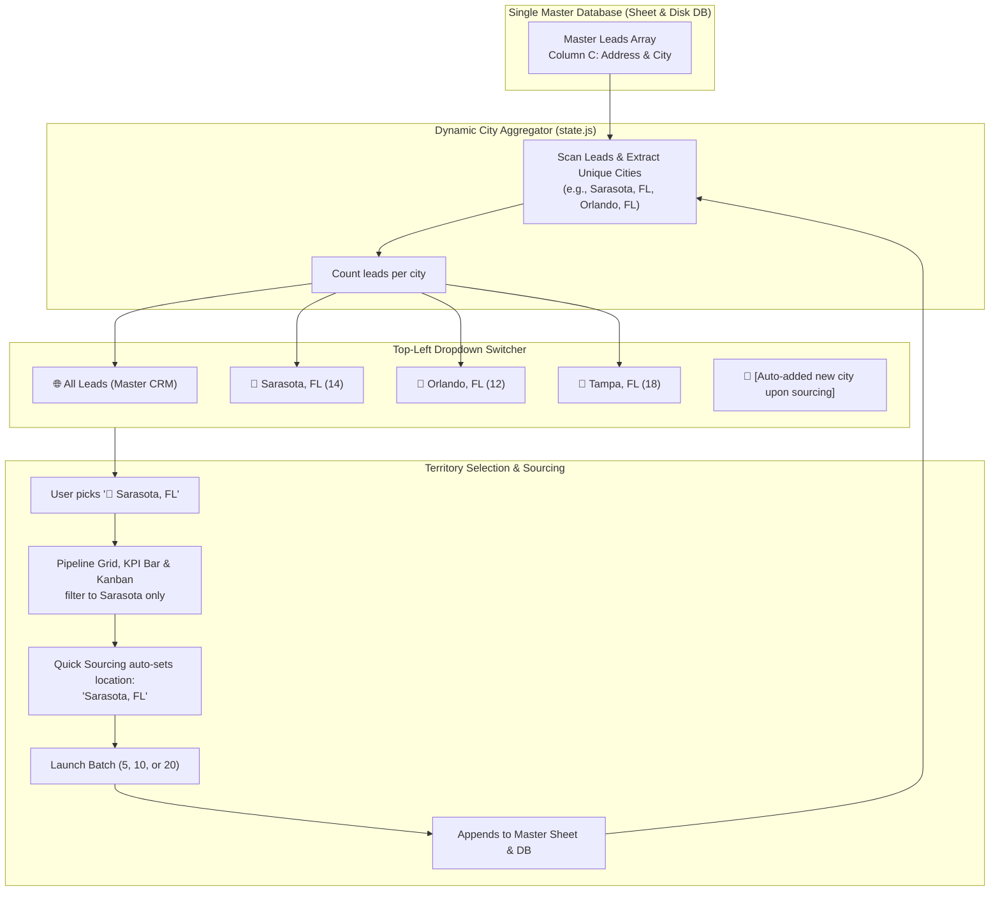

# Technical Plan: Automated City Territory Dropdown Engine

## 1. Overview & Goal

Consolidate all campaign and geographic scoping directly inside the **Top-Left Dropdown Menu** (`#project-select-dropdown`). 

Instead of requiring manual campaign creation or category separation:
1. The dropdown automatically extracts and lists **every City/Metro Territory** present in your CRM with live lead counts.
2. Selecting a city (e.g., `📍 Sarasota, FL (14)`) instantly scopes the **Lead Grid**, **KPI Bar**, and **Kanban Board** to that territory.
3. When sourcing leads for any area, the engine **automatically registers and creates that city** in the dropdown.
4. When a city territory is active, the **Quick Sourcing** tool automatically pre-fills that city so you can instantly deepen your lead pool for that area.
5. All data remains unified in your **Master Google Sheet** (`Master_Prospects_CRM`), ensuring no formula locks or sheet fragmentation.

---

## 2. Dropdown UI Architecture

The dropdown menu will be structured into clean semantic `<optgroup>` sections:

```html
<select class="project-select" id="project-select-dropdown" title="Territory & Campaign Workspace">
  <!-- 1. Master View -->
  <option value="ALL">🌐 All Leads — Master CRM (52)</option>

  <!-- 2. Auto-Populated City Territories -->
  <optgroup label="─── CITIES / TERRITORIES ───">
    <option value="TERRITORY:Sarasota, FL">📍 Sarasota, FL (14)</option>
    <option value="TERRITORY:Tampa, FL">📍 Tampa, FL (18)</option>
    <option value="TERRITORY:Orlando, FL">📍 Orlando, FL (12)</option>
    <option value="TERRITORY:Austin, TX">📍 Austin, TX (8)</option>
  </optgroup>

  <!-- 3. Dedicated Custom Workspaces (Optional) -->
  <optgroup label="─── CUSTOM CAMPAIGNS ───">
    <option value="solar-roofing-fl">📁 Solar & High-Ticket Roofing (FL) (1)</option>
    <option value="medspa-pilot">📁 MedSpa & Aesthetics Pilot (0)</option>
  </optgroup>
</select>
```

---

## 3. Data Flow & Auto-Creation Mechanics



---

## 4. Key Behaviors & Workflow

### A. When in Sarasota
1. Click the top-left dropdown and pick **`📍 Sarasota, FL (14)`**.
2. **Instant View Filtering:**
   - The Lead Grid shows only Sarasota businesses across all categories (Roofing, MedSpa, HVAC, Plumbing).
   - The KPI Bar calculates average opportunity scores, review deficit, and website rebuild rates specifically for Sarasota.
   - The Kanban board only shows Sarasota prospects moving across outreach stages.
3. **Contextual Lead Sourcing:**
   - Navigating to **Quick Lead Generation** automatically pre-fills `Target Geospatial Vector`: **`Sarasota, FL`**.
   - Launching a 10-lead batch appends 10 new Sarasota leads directly into your database.
   - The dropdown immediately increments: **`📍 Sarasota, FL (24)`**.

### B. Moving to Orlando
1. Click the dropdown and select **`📍 Orlando, FL (12)`**.
2. The entire dashboard instantly switches to your Orlando territory.

### C. Exploring a Brand New Market (e.g., St. Petersburg, FL)
1. In Quick Sourcing or Market Analyzer, enter **`St. Petersburg, FL`** and click **Source Leads**.
2. As soon as the leads are generated and saved:
   - The engine automatically detects the new city.
   - An entry for **`📍 St. Petersburg, FL (10)`** is automatically created and inserted into the dropdown.
   - The active view automatically switches to the new territory.

---

## 5. Files to Update

1. **[`src/js/state.js`](file:///c:/Users/forth/.gemini/antigravity/scratch/lead-command-center/src/js/state.js):**
   - Add `activeTerritoryCity` property (e.g., `"ALL"` or `"Sarasota, FL"`).
   - Add `getTerritories()`: Scans all leads, extracts clean city names, counts leads per city, and sorts alphabetically or by count.
   - Update `getLeads()`: When `activeTerritoryCity !== "ALL"`, filters leads matching that city.
   - Persist selected territory to `localStorage`.

2. **[`src/js/components/projectSwitcher.js`](file:///c:/Users/forth/.gemini/antigravity/scratch/lead-command-center/src/js/components/projectSwitcher.js):**
   - Re-render the `<select>` dropdown with `<optgroup>` containing `All Leads (Master CRM)`, dynamic `📍 City Territories`, and `📁 Custom Campaigns`.
   - On change, update `state.activeTerritoryCity` and trigger a clean state notification.

3. **[`src/js/components/quickSourcing.js`](file:///c:/Users/forth/.gemini/antigravity/scratch/lead-command-center/src/js/components/quickSourcing.js):**
   - When rendering, if an active city territory is selected (e.g. `Sarasota, FL`), set `#sourcing-location-input` default value to that city.
   - After sourcing completes, set `activeTerritoryCity` to the newly sourced city so the user lands right in their new territory.

4. **[`src/js/components/kpiBar.js`](file:///c:/Users/forth/.gemini/antigravity/scratch/lead-command-center/src/js/components/kpiBar.js) & [`src/js/components/kanbanBoard.js`](file:///c:/Users/forth/.gemini/antigravity/scratch/lead-command-center/src/js/components/kanbanBoard.js):**
   - Automatically inherit the filtered leads from `state.getLeads()`, guaranteeing synchronized numbers across all tabs.

---

## 6. Verification Steps
1. Verify dropdown renders `🌐 All Leads` + auto-detected cities (`📍 Austin, TX`, `📍 Sarasota, FL`, `📍 Tampa, FL`, `📍 Orlando, FL`).
2. Verify selecting `📍 Sarasota, FL` displays only Sarasota leads and filters KPI stats.
3. Verify Quick Sourcing defaults location input to the active city territory.
4. Verify sourcing a new city (e.g. `St. Petersburg, FL`) immediately adds `📍 St. Petersburg, FL` into the dropdown and updates counts without page reload.
5. Verify Master Google Sheet sync remains completely intact.
