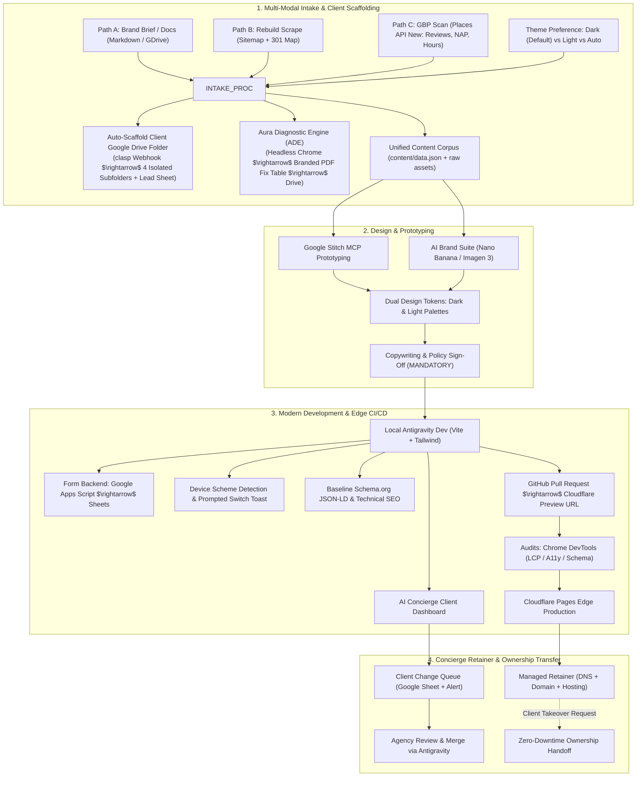
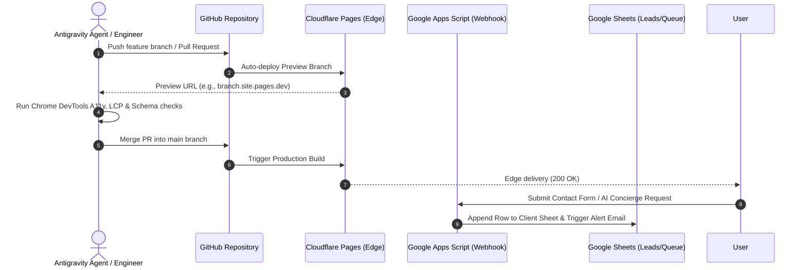
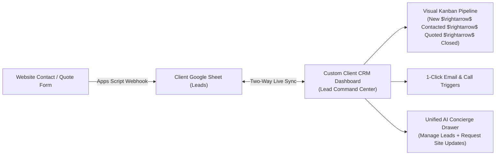

# Eye Of Ru Enterprises — Web Production Formula & Operating Blueprint
**Stack**: Google Antigravity & AI Suite $\rightarrow$ GitHub CI/CD $\rightarrow$ Cloudflare Pages (Edge CDN)  
**Cloud Automation**: Google Apps Script managed via `@google/clasp` $\rightarrow$ Google Drive

---

## Executive Lifecycle Architecture



---

## 1. Multi-Modal Data Retrieval & Client Drive Scaffolding

Every project begins with automated data extraction and isolated Google Drive provisioning before any frontend code is authored.

### A. Isolated Client Google Drive Architecture
Every client project is provisioned its own dedicated folder tree in Google Drive via our `clasp`-managed webhook (`gas-drive-ingestion/Code.js`):

```text
My Drive/
└── Eye Of Ru Enterprises/
    └── Clients/
        └── [Client Business Name]/
            ├── 01_Audits & Proposals/
            │   └── [Date]_[Domain]_Audit_Report.pdf
            ├── 02_Brand Assets & Media/
            │   ├── Logos (Master Cyber Emblem & Vector Monogram)
            │   ├── Storefront / Project Photos
            │   └── OpenGraph 1200x630px Social Cards
            ├── 03_Data & Lead Sheets/
            │   └── [Client Name] — Operational Data & Leads (Tabs: Leads, Staging_Queue)
            └── 04_Production Handoff/
                ├── 301_redirects.csv
                └── Domain & Cloudflare Transfer Checklist
```

### B. Intake Channels
* **Path A: Brand Brief / Document Import**: Ingests value proposition, NAP, testimonials, team bios, and services into `content/data.json`.
* **Path B: Existing Site Scrape & 1:1 301 Redirect Mapping (Rebuilds)**:
  * Crawls existing sitemap and builds Cloudflare `_redirects` file to preserve search rankings.
  * Ingests page copy, headings, and high-res media.
* **Path C: No Website / Google Business Profile (GBP) Scan**:
  * Queries Google Places API (New) via `GOOGLE_MAPS_API_KEY` to extract verified NAP, operating hours, top 5-star customer reviews, storefront photos, and auto-generates `schema.org/LocalBusiness` JSON-LD.

### C. Intake Theme Questionnaire
During onboarding, every client brief captures their fundamental brand aesthetic:
* **Default Theme Preference**:
  1. **Dark Theme (Studio Standard)**: Luxury obsidian/slate (`#07090b`), high-contrast metallic bronze/gold accents.
  2. **Light Theme**: Warm porcelain/clean white, obsidian typography, bronze/accent highlights.
  3. **Auto / Adaptive**: Matches visitor's operating system setting on first visit.
* **Device Prompt Toggle**: Enable/disable the intelligent **Device-Match Switcher Toast**.

### D. Approved Structural Archetypes
During intake, choose the structural archetype matching client scope:
* **Archetype A: Multi-Page Application (MPA)**:
  - Separate static pages (`/index.html`, `/about.html`, `/services.html`, `/contact.html`, `/privacy.html`).
  - Best for large editorial sites, high-SKU services, or multi-location businesses with distinct keyword landing pages.
  - Requires `rollupOptions.input` multi-page entries in `vite.config.js`.
* **Archetype B: Single-Page Anchor Narrative + Modals (Studio Standard)**:
  - Unified, high-density landing narrative (`/#philosophy`, `/#ventures`, `/#capabilities`, `/#inquiry`) with full-screen interactive modal dialogs for deep content, plus dedicated sub-pages (`/concierge.html`, `/privacy.html`).
  - Best for high-converting local service businesses, studios, and fast MVP rebuilds.
  - Strict 301 redirects map legacy URLs to hash sections (e.g. `/services` $\rightarrow$ `/#services`).

### E. Dynamic Content Rendering & Zero-Corpus Self-Collapsing Standard
* **Zero-Corpus Auto-Hiding / Self-Collapsing Mandate**:
  - If a content section (e.g., Articles, Blogs, Dispatches, Testimonials, Case Studies, FAQs) contains zero verified items in `content/data.json`:
    1. The section DOM container is completely omitted or styled `hidden` (`display: none`).
    2. All associated navigation anchor links (in desktop `<header nav>`, mobile drawer `#mobileMenu`, and footer) are automatically omitted or hidden so visitors never encounter dead navigation links.
    3. Never generate dummy placeholder cards, fake "Coming Soon" fillers, or synthetic Lorem Ipsum articles.
* **Cognitive Read-Time Calculation Standard**:
  - Reading times must never be hardcoded as arbitrary string estimates (e.g. `5 min read`, `8 min read`).
  - Reading times are dynamically calculated from the exact word count of the article text using standard cognitive reading cadence (200 words per minute, rounded up, minimum 1 minute):
    $$\text{Read Time (minutes)} = \max\left(1, \left\lceil \frac{\text{Word Count}}{200\text{ WPM}} \right\rceil\right)$$
  - Format: `[X] min read`. Automatically parsed during component rendering.

---

## 2. The Aura Diagnostic Engine (ADE) & Branded PDF Generator

When auditing a client website (for a pitch or rebuild baseline), the engine scans the URL across the **5-Pillar Friction Framework**:
1. **Speed & Core Web Vitals (FCP, LCP, TBT, CLS)** + Bounce Cost Calculator.
2. **Asset & Media Bloat**: Oversized PNGs/JPEGs, missing `alt` tags, missing image dimensions.
3. **Third-Party Script Drag**: Chatbot lag, un-deferred tracking pixels, render-blocking web fonts.
4. **UX & Spatial Typography**: Contrast ratios (< 4.5:1), font sizes < 14px on mobile, tap target cramping.
5. **Local SEO & Schema Gaps**: Missing `LocalBusiness` JSON-LD, missing OpenGraph cards, broken canonicals.

### Deliverables:
* **The Executive Fix Table**: Translates technical errors into direct revenue impacts and our modern fixes.
* **Print-Ready Branded PDF**:
  * Compiled headlessly via local Chrome (`--headless=new --print-to-pdf --no-pdf-header-footer`) in < 1.5s.
  * Branded with the official **Eye Of Ru Cyber-Sovereignty Emblem** (`assets/logo.jpg`), metallic bronze accents, and corporate disclosures.
  * Automatically pushed to the client's `01_Audits & Proposals/` Google Drive folder via our `clasp` webhook endpoint.

---

## 3. Design Layout, Typography & Dual-Theme Architecture

### A. Dual Token Palette Architecture & WCAG AA Compliance
All web builds engineered by Eye Of Ru Enterprises must enforce strict WCAG AA contrast ratios (minimum 4.5:1 for body copy, 3:1 for large headings and UI borders) across both palettes.

```
┌────────────────────────────────────────────────────────────────────────────────────────┐
│                        DUAL-THEME SPECIFICATION & CONTRAST RATIOS                      │
├─────────────────────┬──────────────────────────┬──────────────────────────┬────────────┤
│ Token Role          │ Dark Theme (Default)     │ Light Theme (Inverted)   │ WCAG Ratio │
├─────────────────────┼──────────────────────────┼──────────────────────────┼────────────┤
│ Canvas / Backdrop   │ `#07090b` (Deep obsidian)│ `#f8fafc` (Warm slate)   │ Canvas Ref │
│ Card Surfaces       │ `#0d0f12` (Elev: `#13161b`)│ `#ffffff` (Elev: `#f1f5f9`)│ Surface Ref│
│ Borders & Dividers  │ `#1a1e24` (Subtle dark)  │ `#e2e8f0` (Subtle slate) │ 3.0:1+     │
│ Headlines / Primary │ `#f8fafc` (Crisp white)  │ `#0f172a` (Obsidian)     │ > 15:1     │
│ Body Text           │ `#cbd5e1` (Light slate)  │ `#334155` (Slate text)   │ > 9:1      │
│ Metadata / Muted    │ `#94a3b8` (Muted slate)  │ `#64748b` (Deep muted)   │ > 4.6:1    │
│ Accent Typography   │ `#e5be7d` (Metallic gold)│ `#92400e` (Burnished amber)│ > 5.5:1    │
│ Primary CTA Fill    │ `#c89b4e` (Text: `#07090b`)│ `#ad7e35` (Text: `#ffffff`)│ > 4.5:1    │
│ Mobile Drawer Menu  │ `#0d0f12` (Text: `#cbd5e1`)│ `#ffffff` (Text: `#0f172a`)│ > 15:1     │
│ Telemetry Pills     │ `#13161b` (Text: `#cbd5e1`)│ `#e2e8f0` (Text: `#334155`)│ > 9:1      │
└─────────────────────┴──────────────────────────┴──────────────────────────┴────────────┘
```

### B. The Accent Inversion Rule (Gold / Bronze Palettes)
* **The Failure Mode**: Pale gold (`#e5be7d` / `#c89b4e`) renders beautifully on dark obsidian, but on a white or light slate background has an unacceptable contrast ratio of 1.8:1 to 2.4:1 (illegible and washed out).
* **The Inversion Requirement**: In Light Theme, all accent typography, badge labels, and outline buttons **MUST invert to a deep burnished amber/bronze** (`#92400e` or `#8a5f22`), providing a crisp 5.8:1+ contrast ratio against `#ffffff` and `#f8fafc`.

### C. Component Synchronization Standards
1. **Mobile Navigation Drawer (`#mobileMenu`)**:
   - The drawer background must never remain dark charcoal when the page switches to Light Theme.
   - Light mode drawer: `bg-white border-b border-slate-200 shadow-xl`, with link items styled in `text-slate-800 hover:text-amber-800`.
2. **Telemetry Pills & Status Chips**:
   - Must transition smoothly: Dark uses `bg-charcoal-850 border-charcoal-700 text-slate-300`; Light uses `bg-slate-100 border-slate-300 text-slate-700`.
3. **Outline Action Buttons**:
   - Dark mode: `bg-charcoal-950 border-bronze-500/40 text-bronze-400`.
   - Light mode: `bg-white border-amber-700/40 text-amber-800 hover:bg-slate-50`.
4. **Anti-Pattern Ban**:
   - Never use unpaired opacity utility classes (e.g. `bg-charcoal-900/95`) on structural containers without explicit `dark:` variant pairing (e.g. `bg-white dark:bg-charcoal-900/95 text-slate-900 dark:text-slate-300`).

### D. Device Detection & Prompted Switch Pop-Up Engine
* **Zero FOUC**: An inline script in `<head>` immediately sets the `html` class (`dark` or `light`) based on `localStorage` before the DOM renders.
* **Prompted Switch Toast**: If the visitor's device OS setting (`prefers-color-scheme`) differs from the site default, a discreet floating toast appears in the bottom right corner:
  > *"We noticed your device is set to Light Mode. Would you like to switch to Light Theme?"*
  > `[ Switch to Light ]` `[ Keep Dark ]`
* **Manual Toggle**: Accessible Sun/Moon toggle in the navigation bar and footer.

### E. Dynamic Client Brand Palettes & The Mathematical Contrast Governor
When onboarding new clients, rebuilds, or rebrands with their own unique brand identities (e.g. Navy & Coral, Emerald & Slate, Terracotta & Sand), the engineering pipeline follows [client-brand-palette-architecture.md](client-brand-palette-architecture.md):
1. **Brand-Agnostic Semantic HTML**: All templates use semantic functional utility classes (`bg-canvas`, `bg-surface`, `bg-drawer`, `text-primary`, `text-secondary`, `text-accent`, `bg-accent`, `border-theme`) rather than hardcoded brand color names.
2. **Mathematical Contrast Governor**: Client brand colors ingested via Path A (brief), Path B (site scrape), or Path C (GBP scan) are evaluated using relative luminance ($L = 0.2126R + 0.7152G + 0.0722B$):
   - High-luminance colors (e.g. gold, yellow, cyan) are kept luminous for Dark Mode, but automatically shade-shifted to deep burnished tones for Light Mode (guaranteeing $\ge 4.5:1$ contrast against white).
   - Low-luminance colors (e.g. navy, forest green) are used directly for Light Mode, but tint-shifted to luminous ice/pastel tones for Dark Mode.
3. **Automated Token Injection**: The calculated dual palettes are normalized in `content/data.json` and injected into `src/style.css` (CSS variables) and `tailwind.config.js`.

---

## 4. Non-Negotiable Schema & Technical SEO Standards (Every Site & Page)

Every single site and page engineered by Eye Of Ru Enterprises adheres to strict baseline SEO rules:

1. **Page-Specific Schema.org JSON-LD (`@graph`)**:
   * **Home (`/`)**: `schema.org/LocalBusiness` (or `ProfessionalService`) + `WebSite` graph with verified NAP, logo, geo-coordinates, and `sameAs` authority links.
   * **About (`/about`)**: `schema.org/AboutPage` linked back to the parent organization, founders, and credentials.
   * **Services (`/services`)**: `schema.org/OfferCatalog` & `Service` schema defining specific service deliverables and pricing tiers.
   * **Contact (`/contact`)**: `schema.org/ContactPage` with exact operating hours, telephone, contact email, and interactive map coordinates.
   * **FAQ Sections**: `schema.org/FAQPage` structured data for expandable rich snippets.
2. **Complete `<head>` Meta Protocol**:
   * Unique Canonical URL: `<link rel="canonical" href="...">`.
   * Title formula: `[Primary Service] in [Location] | [Brand Name]` (50–60 chars).
   * Active Meta Description: 145–158 chars with CTA and phone/location.
   * OpenGraph + Twitter Cards with high-contrast 1200x630px preview image.
3. **Asset & Semantic Attributes**:
   * Single `<h1>` per page; ordered `<h2>` and `<h3>` tags with zero skipped levels.
   * Descriptive, hyphenated image filenames; meaningful contextual `alt` attributes.
   * Explicit `width` and `height` dimensions on all images (Zero CLS).
   * Hero image `fetchpriority="high"`; below-the-fold assets `loading="lazy"`.
4. **Crawl Infrastructure & Machine Manifests**:
   * Root `robots.txt` and canonical `sitemap.xml` with `<lastmod>` timestamps.
   * **The `/llms.txt` Standard (Commercial Funnel & Anti-Cannibalization)**: Token-optimized Markdown summary (`/llms.txt`) designed as a commercial teaser for AI engines (SearchGPT, Perplexity, Claude, Gemini). Employs the mandatory 5-section schema (Title/hook, capabilities, geographic perimeter, upfront pricing tiers, verified contact endpoints) while strictly omitting proprietary SOPs, checklists, or internal execution playbooks to prevent IP cannibalization.
5. **Generative Engine Optimization (GEO) & AI Agent Accessibility**:
   * **Static Edge Compilation**: Sub-50ms static DOM response avoids AI scraper execution timeouts and compute budget dropouts.
   * **Schema Ground Truth**: Comprehensive `@graph` eliminates probabilistic hallucination in AI synthesis.
   * **Semantic Form Controls**: Strict HTML5 `<label for="...">` and standardized `autocomplete` tokens (`name`, `email`, `tel`) for autonomous browser agents (e.g. Claude Computer Use, Operator).
   * **Multi-Channel Fallbacks & Verified Data Integrity**: Provide un-gated fallback channels (Email `mailto:`, Form, and Phone `tel:` if verified in client corpus; omit `tel:` for email-first models). **STRICTLY PROHIBITED FROM GENERATING 555-XXXX NUMBERS**; agents must cue the user if contact data is missing.

---

## 5. Scope Matrix: Standard Pages vs. Billable Add-Ons

| Tier / Category | Deliverables Included | Scope Boundary & Specifications |
| :--- | :--- | :--- |
| **Standard Core Build**<br/>*(Foundational Package)* | **5 Standard Pages**:<br/>1. **Home / Landing Page**<br/>2. **About / Story / Company**<br/>3. **Core Services / Offerings**<br/>4. **Contact / Lead Capture**<br/>5. **Privacy Policy & Terms** | • Responsive mobile/desktop layout<br/>• Google Apps Script webhook to Google Sheets lead form<br/>• Cloudflare Turnstile spam protection<br/>• Dual Theme support (Dark/Light) + Prompted Switch Toast<br/>• Non-negotiable baseline Schema.org JSON-LD & full SEO tags<br/>• Core Web Vitals optimization (100 LCP / Accessibility)<br/>• Dual Analytics (Cloudflare Web Analytics default) |
| **Billable Add-On: AI Brand & Logo Suite** | • Primary Logo Lockup (Horizontal & Vertical, Dark & Light)<br/>• Monogram / Favicon vector badge<br/>• OpenGraph 1200x630px social card | Generated via **Nano Banana / Imagen 3** engine ($497 – $1,200 add-on). |
| **Billable Add-On: Dynamic Blog / Articles** | • Headless Git-backed Markdown collection (`/content/blog/`)<br/>• Tag filters, reading time, author bio, social sharing<br/>• Choice of publishing: AI Concierge, Decap CMS, or Retainer | $500 – $1,200 one-time setup (or $450 – $1,200/mo managed growth retainer). |
| **Billable Add-On: AI Concierge Client Dashboard** | • Private `/concierge` client portal / chatbot<br/>• Conversational update assistant powered by Gemini API<br/>• Staged changes queue to Agency Google Sheet<br/>• **Client-Only Access (Strictly Unlinked)**: Never linked in public menus or footers; accessed via private Google Drive shortcut, direct onboarding bookmark, or discreet stealth operator trigger. | Monthly retainer or premium add-on for client self-service change requests. |
| **Billable Add-On: Advanced Functionality** | • Interactive cost estimators / calculators<br/>• Live booking / calendar synchronization<br/>• Client Portal / Password-protected member areas<br/>• Filterable / searchable product/service databases | Custom scoped serverless applications. |
| **Billable Add-On: E-Commerce & Payments** | • Stripe Checkout integration<br/>• Cart & mini-cart flyout<br/>• Product catalog (> 10 items) & inventory sync | Scoped by SKU count and fulfillment logic. |

---

## 6. Modern Tech Stack & Pipeline: Antigravity $\rightarrow$ GitHub $\rightarrow$ Cloudflare Pages



### A. Lead Capture & Form Backend Architecture
* **Frontend**: Lightweight HTML form with **Cloudflare Turnstile** invisible CAPTCHA.
* **Serverless Backend**: Standardized **Google Apps Script Webhook** (No recurring third-party form fees like Formspree).
  * Automatically receives form payload via POST.
  * Writes the lead to a dedicated tab in the client's Google Sheet (`Leads`).
  * Triggers an immediate branded notification email to the client's inbox.
  * Provides instant ownership handoff: simply share/transfer the Google Sheet!

### B. Security, Edge Headers & Dual Analytics
* **Edge Headers (`_headers` file)**:
  * Strict Content-Security-Policy (CSP).
  * `X-Frame-Options: DENY`.
  * `X-Content-Type-Options: nosniff`.
  * `Referrer-Policy: strict-origin-when-cross-origin`.
  * `Permissions-Policy: camera=(), microphone=(), geolocation=()`.
* **Dual Analytics Strategy**:
  * **Default**: Cloudflare Web Analytics (100% privacy-first, zero cookie consent banner, 0ms latency impact).
  * **Client Opt-In**: Google Tag Manager / GA4 container injected conditionally when conversion tracking or Google Ads attribution is required.

---

## 7. Domain Retainer & Zero-Downtime Client Ownership Transfer Protocol

To guarantee smooth operations under our managed retainer while ensuring seamless client handoffs without downtime:

1. **Managed Retainer Phase**:
   * Agency registers/manages domain and hosts DNS in Agency Cloudflare.
   * Client enjoys fully hands-off hosting, edge caching, and AI Concierge updates.
2. **Clean Ownership Handoff Protocol**:
   * **GitHub Transfer**: Transfer repository ownership directly to client's GitHub account.
   * **Cloudflare Pages**: Client creates a free Cloudflare account, connects the transferred repo, and verifies preview build.
   * **Domain & DNS Push**: Domain is pushed to client's registrar account (or Cloudflare Registrar) with existing nameservers/DNS records intact. Transition takes place at Cloudflare's edge with **zero downtime**.
   * **Asset & Lead Handoff**: Transfer ownership of the client's master Google Drive folder (`Eye Of Ru Enterprises / Clients / [Client Name]`), instantly handing off their leads, audits, and assets.

---

## 8. Strategic Roadmap: Custom Client CRM & Lead Dashboard (Lead Command Center)



### A. Architectural Vision
Transform the client's underlying Google Sheet (`Leads`) into a **modern, proprietary web CRM dashboard** (e.g. `/portal` or `portal.clientdomain.com`):
* **Live Two-Way Synchronization**: Reads incoming rows from their Google Sheet in real-time; updates status changes back to the sheet automatically.
* **Visual Kanban Pipeline**: Drag-and-drop cards across deal stages (`New Lead` $\rightarrow$ `Contacted` $\rightarrow$ `Estimate Sent` $\rightarrow$ `Won / Closed`).
* **1-Click Communications**: Quick-action buttons to launch phone calls, send pre-drafted quote confirmation emails, or send appointment SMS.
* **Unified Client Portal**: Houses both the **Lead Command Center** and the **AI Concierge**, giving business owners a single, branded dashboard to run customer inquiries and manage their website.

### B. Business & Retainer Monetization
* **Setup Tier**: Add-on product ($1,200 – $2,500 custom build fee).
* **Monthly Retainer Tier**: Replaces fragmented subscriptions like HubSpot/Jobber for local service businesses ($99 – $299/month recurring agency SaaS retainer).

---

## 9. Non-Negotiable Visual & Typography Standards: Clean Minimal Design, Button Icons & Zero Emojis

Eye Of Ru Enterprises enforces a strict enterprise aesthetic across all digital touchpoints:

1. **Clean Minimalist Design Philosophy**:
   - Always start with the cleanest, minimal approach and design until directed otherwise.
   - Let structure, high-contrast dark/light tokens, deliberate whitespace, and refined typography carry the brand dignity without unnecessary visual noise or clutter.
2. **Icons for Button Identification**:
   - Clean vector icons (SVGs) may be utilized for button identification and clear action affordance (e.g. search, menu drawer, close modal, theme toggle, external link chevrons).
   - Buttons must **never include additional decorative characters, emoji glyphs, or unprompted symbols** alongside them unless explicitly asked for.
3. **Absolute Prohibition on Emojis**:
   - Never add emojis to email subject lines, email templates, push notifications, UI buttons, toasts, headings, modal windows, or documentation.
   - Raw emojis cause RFC 2047 MIME encoding failures across email clients (rendering as diamond question mark boxes) and compromise executive credibility.
4. **Clean ASCII & Typographic Badges**:
   - Use clean, bracketed ASCII labels for statuses, alerts, and badges (e.g. `[NEW LEAD]`, `[SYSTEM MATCH]`, `[CRITICAL]`, `[HIGH]`, `[VERIFIED]`).


